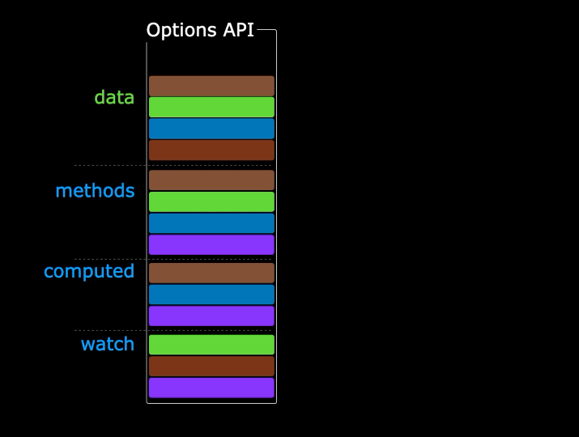
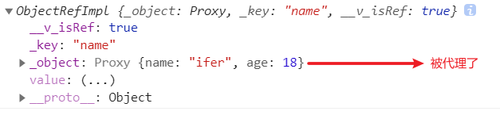
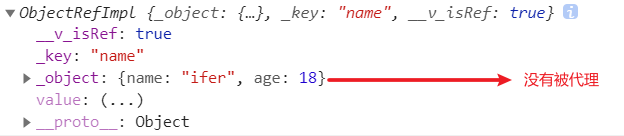
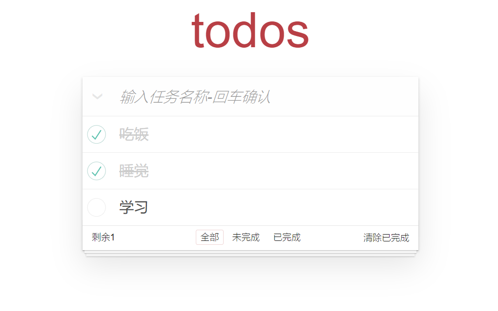
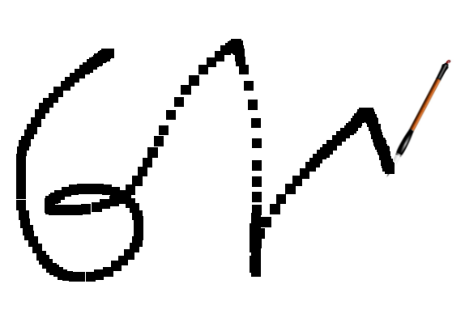

## 00. Vue3 & Vite

🚩 **Vue3**

1、Performance

2、[Tree Shaking support](https://v3.cn.vuejs.org/guide/migration/global-api-treeshaking.html#_2-x-%E8%AF%AD%E6%B3%95)

3、**Composition API**

4、Better TS support

5、Custom Renderer API

6、Fragment、Teleport、Suspense

🚩 **Vite**

[是什么](https://cn.vitejs.dev/)：下一代前端构建工具

`vue-cli`  是基于 `webpack` 的脚手架，`vite-app` 基于 `vite` 的脚手架

```bash
# 用基于 vite 的 vite-app 脚手架来初始化项目
# 使用 npm 创建
npm init vite-app <project-name>
cd <project-name>
npm i
npm run dev
```

```bash
# 使用全局安装的 vite 创建
npm i -g create-vite-app
create-vite-app <project-name>
cd <project-name>
npm i
npm run dev
```

## 01. Options and Compositions

### 1.1、Vue2 做个留言本

Vue3 是兼容 Vue2 的，可以使用 Vue2 的写法也可以混合使用（但不建议），下面是用 Vue2 做的点击删除的案例！


```vue
<template>
    <div>
        <form @submit.prevent="handleSubmit">
            <input type="text" v-model="user.id" />
            <input type="text" v-model="user.name" />
            <input type="submit" />
        </form>
        <ul>
            <li v-for="(item, index) in arr" :key="item.id" @click="handleClick(index)">{{ item.name }}</li>
        </ul>
    </div>
</template>

<script>
export default {
    name: 'App',
    data() {
        return {
            user: {
                id: '',
                name: '',
            },
            arr: [
                {
                    id: 0,
                    name: 'ifer',
                },
                {
                    id: 1,
                    name: 'elser',
                },
                {
                    id: 2,
                    name: 'xxx',
                },
            ],
        };
    },
    methods: {
        handleClick(index) {
            this.arr.splice(index, 1);
        },
        handleSubmit() {
            const userCopy = Object.assign({}, this.user);
            this.arr.push(userCopy);
            this.user.id = '';
            this.user.name = '';
        },
    },
};
</script>
```

### 1.2、上面写法的问题

上面代码最大的问题是：数据和业务逻辑分散在同一个文件的 N 个地方，不利于管理和维护。


随着业务复杂度的上升，可能会出现下图情况！


### 1.3、如何解决

期望数据和业务逻辑放一起（可以拆分方法和文件），怎么解决？

[why-composition-api](https://v3.vuejs.org/guide/composition-api-introduction.html#why-composition-api)

[composition-api-doc](https://v3.cn.vuejs.org/api/composition-api.html)

Vue3 推出的组合 API，又称注入 API，因为 composition API 的本质还是会把数据或方法注入到 data 和 methods 中！




## 02. setup

1、实例创建前调用，执行时机早于 Vue2 中的 `beforeCreate`，它是组合 API 的入口函数

2、注意点：由于执行 `setup` 的时候实例还没有 `created`，所以在 `setup` 中是不能直接使用 `data` 和 `methods` 中的数据的，Vue 干脆把 `setup` 中的 this 绑定了 undefined，防止你乱用！

3、`setup` 接收 2 个参数，props 和 context

```js
const {attrs,slots,parent,root,emit} = context
```

4、`setup` 返回的数据和函数可在模版中直接使用（注意 `setup` 不能为异步函数），下面是演示代码

```vue
<template>
    {{ username }}
    <button @click="handleClick">click</button>
</template>

<script>
export default {
    name: 'App',
    beforeCreate() {
        console.log(2);
    },
    setup() {
        // 先打印 1 再打印 2，证明执行时机早于 beforeCreate
        console.log(1);
        let username = 'Hello World';
        const handleClick = () => {
            console.log('Hello World');
        };
        return {
            username,
            handleClick,
        };
    },
};
</script>
```

## 03. reactive

### 3.0、问题重现

需求：点击删除当前行信息，问题：数据确实是删了，但不是响应式的！

```vue
<template>
    <ul>
        <li v-for="(item, index) in arr" :key="item" @click="removeItem(index)">{{ item }}</li>
    </ul>
</template>

<script>
export default {
    name: 'App',
    setup() {
        const arr = ['a', 'b', 'c'];
        const removeItem = (index) => {
            arr.splice(index, 1);
        };
        return {
            arr,
            removeItem
        };
    }
};
</script>
```

`reactive` 是一个函数，通常用来将普通对象/数组包装成响应式式数据使用

### 3.1、包装数组

```vue
<template>
    <ul>
        <li v-for="(item, index) in arr" :key="item" @click="removeItem(index)">{{ item }}</li>
    </ul>
</template>

<script>
import { reactive } from 'vue';
export default {
    name: 'App',
    setup() {
        const arr = reactive(['a', 'b', 'c']);
        const removeItem = (index) => {
            // 点击删除当前项
            arr.splice(index, 1);
        };
        return {
            arr,
            removeItem,
        };
    },
};
</script>
```

### 3.2、包装对象

```vue
<template>
    <ul>
        <li v-for="(item, index) in state.arr" :key="item.id" @click="removeItem(index)">{{ item.name }}</li>
    </ul>
</template>

<script>
import { reactive } from 'vue';
export default {
    name: 'App',
    setup() {
        const state = reactive({
            arr: [
                {
                    id: 0,
                    name: 'ifer',
                },
                {
                    id: 1,
                    name: 'elser',
                },
                {
                    id: 2,
                    name: 'xxx',
                },
            ],
        });
        const removeItem = (index) => {
            state.arr.splice(index, 1);
        };
        return {
            state,
            removeItem,
        };
    },
};
</script>
```

### 3.3、抽离函数

优化：将同一功能的数据和业务逻辑抽离为一个函数，代码更易读，更容易**复用**

```vue
<template>
    <ul>
        <li v-for="(item, index) in state.arr" :key="item.id" @click="removeItem(index)">{{ item.name }}</li>
    </ul>
</template>
<script>
import { reactive } from 'vue';

function userRemoveItem() {
    const state = reactive({
        arr: [
            {
                id: 0,
                name: 'ifer',
            },
            {
                id: 1,
                name: 'elser',
            },
            {
                id: 2,
                name: 'xxx',
            },
        ],
    });
    const removeItem = (index) => {
        state.arr.splice(index, 1);
    };
    return { state, removeItem };
}

export default {
    name: 'App',
    setup() {
        const { state, removeItem } = userRemoveItem();
        return {
            state,
            removeItem,
        };
    },
};
</script>
```

### 3.4、添加功能

```vue
<template>
    <form @submit.prevent="handleSubmit">
        <input type="text" v-model="user.id" />
        <input type="text" v-model="user.name" />
        <input type="submit" />
    </form>
    <ul>
        <li v-for="(item, index) in state.arr" :key="item.id" @click="removeItem(index)">{{ item.name }}</li>
    </ul>
</template>

<script>
import { reactive } from 'vue';

function userRemoveItem() {
    const state = reactive({
        arr: [
            {
                id: 0,
                name: 'ifer'
            },
            {
                id: 1,
                name: 'elser'
            },
            {
                id: 2,
                name: 'xxx'
            }
        ]
    });
    const removeItem = (index) => {
        state.arr.splice(index, 1);
    };
    return { state, removeItem };
}
function useAddItem(state) {
    const user = reactive({
        id: '',
        name: ''
    });
    const handleSubmit = () => {
        /* state.arr.push({
                id: user.id,
                name: user.name
            }); */

        /* state.arr.push({
                ...user
            }); */
        const userCopy = Object.assign({}, user);
        state.arr.push(userCopy);
        user.id = '';
        user.name = '';
    };
    return {
        user,
        handleSubmit
    };
}

export default {
    name: 'App',
    setup() {
        const { state, removeItem } = userRemoveItem();
        const { user, handleSubmit } = useAddItem(state);
        return {
            state,
            removeItem,
            user,
            handleSubmit
        };
    }
};
</script>
```

### 3.5、拆分文件

`remove.js`

```js
import { reactive } from 'vue';
export default function userRemoveItem() {
    const state = reactive({
        arr: [
            {
                id: 0,
                name: 'ifer',
            },
            {
                id: 1,
                name: 'elser',
            },
            {
                id: 2,
                name: 'xxx',
            },
        ],
    });
    const removeItem = (index) => {
        state.arr.splice(index, 1);
    };
    return { state, removeItem };
}
```

`add.js`

```js
import { reactive } from 'vue';
export default function useAddItem(state) {
    const user = reactive({
        id: '',
        name: '',
    });
    const handleSubmit = () => {
        const userCopy = Object.assign({}, user);
        state.arr.push(userCopy);
        user.id = '';
        user.name = '';
    };
    return {
        user,
        handleSubmit,
    };
}
```

`App.vue`

```vue
<template>
    <form @submit.prevent="handleSubmit">
        <input type="text" v-model="user.id" />
        <input type="text" v-model="user.name" />
        <input type="submit" />
    </form>
    <ul>
        <li v-for="(item, index) in state.arr" :key="item.id" @click="removeItem(index)">{{ item.name }}</li>
    </ul>
</template>

<script>
import userRemoveItem from './remove';
import useAddItem from './add';
export default {
    name: 'App',
    setup() {
        const { state, removeItem } = userRemoveItem();
        const { user, handleSubmit } = useAddItem(state);
        return {
            state,
            removeItem,
            user,
            handleSubmit,
        };
    },
};
</script>
```

## 04. Lifecycle

[选项 API](https://v3.cn.vuejs.org/api/options-lifecycle-hooks.html#beforecreate)

[组合 API](https://v3.cn.vuejs.org/api/composition-api.html#%E7%94%9F%E5%91%BD%E5%91%A8%E6%9C%9F%E9%92%A9%E5%AD%90)

### 4.1 Hooks

`setup`：实例创建前

`onBeforeMount`：挂载 DOM 前

`onMounted`：挂载 DOM 后

`onBeforeUpdate`：更新组件前

`onUpdated`：更新组件后

`onBeforeUnmount`：卸载销毁前

`onUnmounted`：卸载销毁后

### 4.2 Practise

<font size=2>**Vue3（组合 API）的生命周期钩子有 7 个，可以多次使用同一个钩子，执行顺序和书写顺序相同**</font>

`App.vue`

```vue
<template>
    <hello-world v-if="state.bBar" />
    <button @click="state.bBar = !state.bBar">destroy cmp</button>
</template>

<script>
import HelloWorld from './components/HelloWorld.vue';
import { reactive } from 'vue';
export default {
    name: 'App',
    components: {
        HelloWorld
    },
    setup() {
        const state = reactive({
            bBar: true
        });
        return {
            state
        };
    }
};
</script>
```

`HelloWorld.vue`

```vue
<template>
    <p>{{ state.msg }}</p>
    <button @click="state.msg = 'xxx'">update msg</button>
</template>

<script>
import { onBeforeMount, onMounted, onBeforeUpdate, onUpdated, onBeforeUnmount, onUnmounted, reactive } from 'vue';
export default {
    name: 'HelloWorld',
    setup() {
        const state = reactive({
            msg: 'Hello World'
        });

        onBeforeMount(() => {
            console.log('onBeforeMount');
        });
        onMounted(() => {
            console.log('onMounted');
        });
        onBeforeUpdate(() => {
            console.log('onBeforeUpdate');
        });
        onUpdated(() => {
            console.log('onUpdated');
        });
        onBeforeUnmount(() => {
            console.log('onBeforeUnmount');
        });
        onUnmounted(() => {
            console.log('onUnmounted');
        });
        return {
            state
        };
    }
};
</script>
```

## 05. 📌 reactive and lifecycle

练习：记录鼠标坐标

<font size=3 color="#ccc">1、定义一个响应式数据对象，包含 x 和 y 属性</font>

<font size=3 color="#ccc">2、在组件渲染完毕后，监听 document 的鼠标移动事件</font>

<font size=3 color="#ccc">3、指定 move 函数为事件对应回调，在函数中修改坐标</font>

<font size=3 color="#ccc">4、组件销毁时，解绑事件</font>

<font size=3 color="#ccc">5、setup 中返回数据，并在模版中使用</font>

```vue
<template>
    <div>x: {{ mouse.x }} y: {{ mouse.y }}</div>
</template>

<script>
import { onMounted, onUnmounted, reactive } from 'vue';
const useMouse = () => {
    const mouse = reactive({
        x: 0,
        y: 0
    });
    const move = (e) => {
        mouse.x = e.pageX;
        mouse.y = e.pageY;
    };
    onMounted(() => {
        document.addEventListener('mousemove', move);
    });
    onUnmounted(() => {
        document.removeEventListener('mousemove', move);
    });
    return mouse;
};
export default {
    name: 'App',
    setup() {
        const mouse = useMouse();
        return {
            mouse
        };
    }
};
</script>
```

## 06. 🧐 shallowReactive

通过 `reactive` 和 `ref` 创建出来的数据都是递归监听的，如果只想监听第一层的变化可以使用 `shallowReactive`

```vue
<template>
    <p>{{ state.age }}</p>
    <p>{{ state.a.b.c.d }}</p>
    <button @click="handleChange">change</button>
</template>

<script>
import { shallowReactive } from 'vue';
export default {
    name: 'App',
    setup() {
        const state = shallowReactive({
            age: 18,
            a: {
                b: {
                    c: {
                        d: 'Hello World',
                    },
                },
            },
        });
        const handleChange = () => {
            // 只有第一层是响应式的，可以通过打印观察到
            // console.log(state);
            // 第一层的更新会影响到后面（注意 state.age 也必须写到模板上面）
            state.age = 19;
            // 如果没有上面的代码直接下面这样写界面是不会更新的
            state.a.b.c.d = 'xxx';
        };
        return { state, handleChange };
    },
};
</script>
```


## 07. 🧐 isReactive

检查对象是否是由 [`reactive`](https://v3.cn.vuejs.org/api/basic-reactivity.html#reactive) 创建的响应式代理

```vue
<template>
    <p>{{ state.id }}</p>
    <button @click="check">检查</button>
</template>
<script>
import { isReactive, shallowReactive } from 'vue';
export default {
    name: 'App',
    setup() {
        const state = shallowReactive({
            id: 8,
            info: {
                name: 'ifer'
            }
        });
        const check = () => {
            console.log(isReactive(state)); // true
            console.log(isReactive(state.info)); // false
        };
        return {
            state,
            check
        };
    }
};
</script>
```

## 08. 🧐 readonly

### 8.1 包装普通对象

```vue
<template>
    <p>{{ state.name }}</p>
    <button @click="handleClick">click</button>
</template>

<script>
import { readonly } from 'vue';

export default {
    name: 'App',
    setup() {
        const origin = {
            name: 'ifer'
        };
        const state = readonly(origin);
        const handleClick = () => {
            state.name = 'xxx';
            console.log(state.name); // 'ifer'
            // 思考和 const 的差异？
            // const 内容可以改，readonly 内容都不可以改
        };
        return { state, handleClick };
    }
};
</script>
```

### 8.2 包装响应式对象

```vue
<template>
    <p>{{ state.name }}</p>
    <button @click="handleClick">click</button>
</template>

<script>
import { reactive, readonly } from 'vue';

export default {
    name: 'App',
    setup() {
        const origin = reactive({
            name: 'ifer'
        });
        // 包装响应式对象，同样不能修改
        const state = readonly(origin);
        const handleClick = () => {
            state.name = 'xxx';
            console.log(state.name);
        };
        return { state, handleClick };
    }
};
</script>
```

## 09. 🧐 shallowReadonly

```vue
<template>
    <p>{{ state.name }}</p>
    <p>{{ state.info.sex }}</p>
    <button @click="handleClick">click</button>
</template>

<script>
import { shallowReadonly } from 'vue';

export default {
    name: 'App',
    setup() {
        // shallowReadonly 创建的数据只是第一层只读
        const state = shallowReadonly({
            name: 'ifer',
            info: {
                sex: 'man',
            },
        });
        const handleClick = () => {
            state.name = 'xxx';
            state.info.sex = '男';
            console.log(state.name); // 'ifer'，第一层的修改没有变化
            console.log(state.info.sex); // '男'，第二层的修改变化了
        };
        return { state, handleClick };
    },
};
</script>
```

## 10. 🧐 isReadonly

检查对象是否是由 [`readonly`](https://v3.cn.vuejs.org/api/basic-reactivity.html#readonly) 创建的只读代理

```vue
<template>
    <p>{{ state.id }}</p>
    <button @click="check">检查</button>
</template>
<script>
import { isReadonly, readonly } from 'vue';
export default {
    name: 'App',
    setup() {
        const state = readonly({
            id: 8,
            info: {
                name: 'ifer'
            }
        });
        const check = () => {
            console.log(isReadonly(state)); // true
            console.log(isReadonly(state.info)); // true
        };
        return {
            state,
            check
        };
    }
};
</script>
```

## 11. 🧐 isProxy

检查对象是否是由 [`reactive`](https://v3.cn.vuejs.org/api/basic-reactivity.html#reactive) 或 [`readonly`](https://v3.cn.vuejs.org/api/basic-reactivity.html#readonly) 创建的 proxy

```vue
<template>
    <p>{{ state.name }}</p>
    <button @click="handleClick">click</button>
</template>

<script>
import { isProxy, reactive, readonly } from 'vue';

export default {
    name: 'App',
    setup() {
        const origin = {
            name: 'ifer'
        };
        const state = readonly(origin);

        const handleClick = () => {
            console.log(isProxy(origin)); // false
            console.log(isProxy(state)); // true

            console.log(isProxy(reactive(origin))); // true
        };
        return { state, handleClick };
    }
};
</script>
```


## 12. 🧐 toRaw

返回 [`reactive`](https://v3.cn.vuejs.org/api/basic-reactivity.html#reactive) 或 [`readonly`](https://v3.cn.vuejs.org/api/basic-reactivity.html#readonly) 代理的原始对象

```vue
<template>Hello World</template>
<script>
import { reactive, readonly, toRaw } from 'vue';
export default {
    name: 'App',
    setup() {
        const origin = {
            name: 'ifer'
        };
        // origin 和 state1 的关系：state1 是根据 origin 生成的，两者的修改会相互影响，但对 origin 的修改不是响应式的
        const state1 = reactive(origin);
        const state2 = readonly(origin);

        console.log(toRaw(state1) === toRaw(state2)); // true
        console.log(toRaw(state1) === origin); // true
    }
};
</script>
```

<font color="red" size=2>注意：获取 ref 类型的数据必须带 `.value`</font>

## 13. 🧐 markRaw

`markRaw` 包装后的数据将不被追踪变化，即便通过 `reactive` 也不能变成响应式数据

```vue
<template>
    <p>{{ state }}</p>
    <button @click="handleClick">click</button>
</template>

<script>
import { reactive, markRaw } from 'vue';
export default {
    name: 'App',
    setup() {
        let obj = {
            name: 'ifer',
            age: 18,
        };
        // obj 将不被追踪，无法成为响应式数据
        // obj = markRaw(obj);
        obj = markRaw(obj);
        const state = reactive(obj);
        const handleClick = () => {
            state.name = 'xxx';
        };
        return {
            state,
            handleClick,
        };
    },
};
</script>
```

------

Todo：官方文档 ref、组合 API、细节变化...

## 14. ref

<font color="red">🤫 注意</font> <font color="#ccc">当你明确知道需要的是一个响应式数据对象，那么就使用 reactive 即可，其他情况使用 ref</font>

### 14.1、定义响应式数据

`ref` 函数，常用于把简单数据类型定义为响应式数据，注意 JS 中修改 ref 类型的值需要加 `.value`，模板中使用 ref 类型的值可以省略 `.value`

```vue
<template>
    <p>{{ username }}</p>
    <button @click="handleClick">click</button>
</template>

<script>
import { ref } from 'vue';
export default {
    name: 'App',
    setup() {
        const username = ref('Hello World');
        const handleClick = () => {
            // 修改的时候需要 .value，模板中使用不需要加 .value，Vue 内部会自动添加
            username.value = 'xxx';
        };
        return {
            username,
            handleClick,
        };
    },
};
</script>
```

🎈 为什么修改数据的时候需要添加 `.value`

因为 `ref` 的本质还是 `reactive`，当我们给 `ref` 传递一个值之后，这个值会作为 `reactive` 对象中的 value 存在 

```vue
<template>
    <p>{{ username }}</p>
    <button @click="handleClick">click</button>
</template>

<script>
import { ref, reactive } from 'vue';
export default {
    name: 'App',
    setup() {
        // 注意明确通过 reactive 定义数据时，并不会在模板中自动添加 .value，需要手动的 username.value
        /* const username = reactive({
            value: 'Hello World',
        }); */
        const username = ref('Hello World');
        const handleClick = () => {
            username.value = 'xxx';
        };
        return {
            username,
            handleClick,
        };
    },
};
</script>
```

🎈 为什么视图中使用 ref 类型的数据不需要加 `.value`，Vue 内部是怎么做的

Vue 内部会使用 `isRef` 和 `isReactive` 方法来判断是 `ref` 还是 `reactive` 数据，以此来决定是否添加 `.value`

### 14.2、计数器

```vue
<template>
    <p>{{ num }}</p>
    <button @click="add()">add</button>
    <button @click="sub()">sub</button>
</template>

<script>
import { ref } from 'vue';
function useCalc() {
    // 初始值
    const num = ref(0);
    // add
    const add = () => {
        num.value++;
    };
    // sub
    const sub = () => {
        num.value--;
    };
    return { num, add, sub };
}
export default {
    name: 'App',
    setup() {
        const { num, add, sub } = useCalc();
        return { num, add, sub };
    },
};
</script>
```

### 14.3、获取元素或组件实例

[参考文档](https://v3.cn.vuejs.org/guide/composition-api-template-refs.html#%E6%A8%A1%E6%9D%BF%E5%BC%95%E7%94%A8)

获取单个 DOM 或组件，注意：获取到的 `oDiv.value` 才是 DOM 元素

```vue
<template>
    <!-- #3 -->
    <div ref="oDiv">Hello World</div>
</template>

<script>
import { onMounted, ref } from 'vue';
export default {
    name: 'App',
    setup() {
        // #1
        const oDiv = ref(null);
        onMounted(() => {
            console.log(oDiv.value);
            oDiv.value.style.backgroundColor = 'red';
        });
        // #2
        return {
            oDiv,
        };
    },
};
</script>
```

获取 v-for 遍历的 DOM 或组件，ref 可以指定为一个函数，函数里面的参数就是每一个 DOM 元素

<font size=2 color=red>注意：这里和 `import { ref } from 'vue'` 没什么关系，但都是获取元素，就放一起说了！</font>

```vue
<template>
    <ul>
        <!-- #4: 注意是 v-bind: 动态绑定的 -->
        <li :ref="setDom" v-for="item in 'ifer'" :key="item">{{ item }}</li>
    </ul>
</template>

<script>
import { onMounted } from 'vue';
export default {
    name: 'App',
    setup() {
        // #1
        const domList = [];
        // #2
        const setDom = (el) => {
            domList.push(el);
        };
        onMounted(() => {
            console.log(domList);
        });
        // #3
        return {
            setDom,
        };
    },
};
</script>
```

### 14.4、转换原始对象中的某个属性为响应式

```vue
<template>
    <p>{{ state }}</p>
    <button @click="handleClick">click</button>
</template>

<script>
import { ref } from 'vue';
export default {
    name: 'App',
    setup() {
        let obj = {
            name: 'ifer',
            age: 18,
        };
        // 这样写本质是把 obj.name 取出来了复制了一份，所以对 state 的修改不会影响原 obj
        const state = ref(obj.name);

        const handleClick = () => {
            state.value = 'xxx';
            console.log(obj);
        };
        return {
            state,
            handleClick,
        };
    },
};
</script>
```

包装原始对象为响应式对象，了解即可，主流写法还是直接用 reactive 进行包装

```vue
<template>
    <p>{{ state }}</p>
    <button @click="handleClick">click</button>
</template>

<script>
import { ref } from 'vue';
export default {
    name: 'App',
    setup() {
        const obj = {
            name: 'ifer',
            age: 18
        };
        // state 是根据复杂数据类型 obj 生成的一个响应式对象，对 state 中内容的修改会影响原对象 obj
        const state = ref(obj);

        const handleClick = () => {
            state.value.name = 'xxx';
            state.value.age = 19;
            console.log(obj);
        };
        return {
            state,
            handleClick
        };
    }
};
</script>
```

### 14.5、转换响应式对象中的某个属性为响应式

需求：只想把响应式对象中的某个属性倒出去供模板使用

问题：发现丢失了响应式

```vue
<template>
    <p>{{ name }}</p>
    <button @click="handleClick">click</button>
</template>

<script>
import { reactive } from 'vue';
export default {
    name: 'App',
    setup() {
        const obj = reactive({
            name: 'ifer',
            age: 18
        });
        // 解构赋值简单数据类型的 name 会使其失去响应式
        // let { name } = obj;
        // 类似的操作还有
        let name = obj.name;
        const handleClick = () => {
            name = 'xxx';
        };
        return {
            name,
            handleClick
        };
    }
};
</script>
```

解决：`let name = ref(obj.name);`

```vue
<template>
    <p>{{ name }}</p>
    <button @click="handleClick">click</button>
</template>

<script>
import { reactive, ref } from 'vue';
export default {
    name: 'App',
    setup() {
        const obj = reactive({
            name: 'ifer',
            age: 18
        });
        let name = ref(obj.name);
        const handleClick = () => {
            name.value = 'xxx';
        };
        return {
            name,
            handleClick
        };
    }
};
</script>
```

## 15. toRef

### 15.1、转换响应式对象中的某个属性

toRef(响应式对象)，影响原，**响应**



```vue
<template>
    <p>{{ state }}</p>
    <button @click="handleClick">click</button>
</template>

<script>
import { reactive, toRef } from 'vue';
export default {
    name: 'App',
    setup() {
        const obj = reactive({
            name: 'ifer',
            age: 18
        });
        // 通过 toRef 将一个对象中的属性变成 ref 数据
        const state = toRef(obj, 'name');
        console.log(state);

        const handleClick = () => {
            state.value = 'xxx';

            // 修改转换后的 ref 数据会影响到原数据，视图也更新了
            console.log(obj);
        };
        return {
            state,
            handleClick
        };
    }
};
</script>
```

### 15.2、转换原始对象中的属性❗

[官方文档](https://v3.cn.vuejs.org/api/refs-api.html#toref)

toRef(普通对象)，影响原，==非响应==



```vue
<template>
    <p>{{ state }}</p>
    <button @click="handleClick">click</button>
</template>

<script>
import { reactive, toRef } from 'vue';
export default {
    name: 'App',
    setup() {
        const obj = {
            name: 'ifer',
            age: 18
        };
        // 通过 toRef 将一个对象中的属性变成 ref 数据
        const state = toRef(obj, 'name');
        console.log(state);

        const handleClick = () => {
            state.value = 'xxx';

            // 修改转换后的 ref 数据会影响到原数据，//!但不会触发视图更新！
            console.log(obj);
        };
        return {
            state,
            handleClick
        };
    }
};
</script>
```


## 16. toRefs

### 16.1 基本使用

[参考文档](https://v3.cn.vuejs.org/guide/reactivity-fundamentals.html#%E5%93%8D%E5%BA%94%E5%BC%8F%E7%8A%B6%E6%80%81%E8%A7%A3%E6%9E%84)

`toRefs` 是函数，用来转换**响应式对象**中的所有属性为单独响应式数据，并且转换后的值和原对象是关联的

```vue
<template>
    <p>{{ username }}</p>
    <button @click="updateUserInfo">update</button>
</template>

<script>
import { reactive, toRefs } from 'vue';
export default {
    name: 'App',
    setup() {
        const userInfo = reactive({
            username: 'ifer',
            age: 18,
        });

        const obj = toRefs(userInfo);

        const updateUserInfo = () => {
            // 使用 toRefs 转换的数据最后要加 .value
            // obj.username.value = 'xxx';
            userInfo.username = 'xxx';
        };

        return {
            ...obj,
            updateUserInfo,
        };
    },
};
</script>
```

### 16.2 举个例子

1、之前讲的获取鼠标坐标的案例

```vue
<template>
    <div>x: {{ mouse.x }} y: {{ mouse.y }}</div>
</template>

<script>
import { onMounted, onUnmounted, reactive, toRefs } from 'vue';
const useMouse = () => {
    const mouse = reactive({
        x: 0,
        y: 0
    });
    const move = (e) => {
        mouse.x = e.pageX;
        mouse.y = e.pageY;
    };
    onMounted(() => {
        document.addEventListener('mousemove', move);
    });
    onUnmounted(() => {
        document.removeEventListener('mousemove', move);
    });
    return mouse;
};
export default {
    name: 'App',
    setup() {
        const mouse = useMouse();
        return {
            mouse
        };
    }
};
</script>
```

2、需求：想直接在模板中使用 x 和 y，而不是 `mouse.x` 和 `mouse.y`，下面是错误写法！

```vue
<template>
    <div>x: {{ x }} y: {{ y }}</div>
</template>

<script>
import { onMounted, onUnmounted, reactive, toRefs } from 'vue';
const useMouse = () => {
    const mouse = reactive({
        x: 0,
        y: 0
    });
    const move = (e) => {
        mouse.x = e.pageX;
        mouse.y = e.pageY;
    };
    onMounted(() => {
        document.addEventListener('mousemove', move);
    });
    onUnmounted(() => {
        document.removeEventListener('mousemove', move);
    });
    return mouse;
};
export default {
    name: 'App',
    setup() {
        const mouse = useMouse();
        // !错误写法
        return {
            x: mouse.x,
            y: mouse.y
        };
    }
};
</script>
```

3、最佳实践

快速生成代码片段：安装插件 `Vue VSCode Snippets`，输入 `vbase-3-reactive`

```vue
<template>
    <div>x: {{ x }} y: {{ y }}</div>
</template>

<script>
import { onMounted, onUnmounted, reactive, toRef, toRefs } from 'vue';
const useMouse = () => {
    const mouse = reactive({
        x: 0,
        y: 0
    });
    const move = (e) => {
        mouse.x = e.pageX;
        mouse.y = e.pageY;
    };
    onMounted(() => {
        document.addEventListener('mousemove', move);
    });
    onUnmounted(() => {
        document.removeEventListener('mousemove', move);
    });
    return mouse;
};
export default {
    name: 'App',
    setup() {
        const mouse = useMouse();
        // 不推荐，因为当有其他数据需要导出时这种写法就不行了
        // return mouse;
        return {
            ...toRefs(mouse)
        };
    }
};
</script>
```

4、当然也可以再封装 `useMouse` 函数的时候，返回的是单值 ref 数据，而不是 reactive 数据

```vue
<template>
    <div>x: {{ x }} y: {{ y }}</div>
</template>

<script>
import { onMounted, onUnmounted, reactive, toRef, toRefs } from 'vue';
const useMouse = () => {
    const mouse = reactive({
        x: 0,
        y: 0
    });
    const move = (e) => {
        mouse.x = e.pageX;
        mouse.y = e.pageY;
    };
    onMounted(() => {
        document.addEventListener('mousemove', move);
    });
    onUnmounted(() => {
        document.removeEventListener('mousemove', move);
    });
    return {
        ...toRefs(mouse)
    };
};
export default {
    name: 'App',
    setup() {
        const { x, y } = useMouse();
        return {
            x,
            y
        };
    }
};
</script>
```

## 17. 📌 易错点复习

### 17.1、需求

需求：只想把用到的简单数据类型 `username` 掏出去

问题：数据不是响应式的了（注意如果掏出去的是复杂数据类型则还是会保留响应式）

```vue
<template>
    <p>{{ name }}</p>
    <button @click="updateName">update</button>
</template>

<script>
import { reactive } from 'vue';
export default {
    name: 'App',
    setup() {
        const userInfo = reactive({
            name: 'ifer',
            age: 18
        });
        const updateName = () => {
            userInfo.name = 'xxx';
        };
        return {
            // 相当于把 userInfo.name 复制了一份给了一个新的变量 name
            // 那么对原 userInfo 中 name 的修改根本不会影响视图中的 name，因为不是一个东西
            // userInfo.name 本身也就是一个普通的字符串
            name: userInfo.name,
            updateName
        };
    }
};
</script>
```

或

```vue
<template>
    <p>{{ name }}</p>
    <button @click="updateName">update</button>
</template>

<script>
import { reactive } from 'vue';
const useUpdateName = () => {
    const userInfo = reactive({
        name: 'ifer',
        age: 18
    });
    const updateName = () => {
        userInfo.name = 'xxx';
    };
    return {
        ...userInfo,
        updateName
    };
};
export default {
    name: 'App',
    setup() {
        const { name, updateName } = useUpdateName();
        return {
            name,
            updateName
        };
    }
};
</script>
```

### 17.2、ref 解决

`const username = ref(userInfo.username);`

```vue
<template>
    <p>{{ username }}</p>
    <button @click="updateUserInfo">update</button>
</template>

<script>
import { reactive, ref } from 'vue';
export default {
    name: 'App',
    setup() {
        const userInfo = reactive({
            username: 'ifer',
            age: 18
        });

        const username = ref(userInfo.username);

        const updateUserInfo = () => {
            username.value = 'xxx';
            // 不会影响原数据
            console.log(userInfo);
        };

        return {
            username,
            updateUserInfo
        };
    }
};
</script>
```

### 17.3、toRef 解决

解决：toRef 是函数，可以转换**响应式对象**中某个属性为单独响应式数据，并且转换后的值和原对象是是关联的

`const username = toRef(userInfo, 'username');`

```vue
<template>
    <p>{{ username }}</p>
    <button @click="updateUserInfo">update</button>
</template>

<script>
import { reactive, toRef } from 'vue';
export default {
    name: 'App',
    setup() {
        const userInfo = reactive({
            username: 'ifer',
            age: 18
        });

        const username = toRef(userInfo, 'username');

        const updateUserInfo = () => {
            username.value = 'xxx';
            // 会影响原数据
            console.log(userInfo);
        };

        return {
            username,
            updateUserInfo
        };
    }
};
</script>
```

### 17.4、toRefs 解决

```vue
<template>
    <p>{{ name }}</p>
    <button @click="updateName">update</button>
</template>

<script>
import { reactive, toRefs } from 'vue';
const useUser = () => {
    const userInfo = reactive({
        name: 'ifer',
        age: 18
    });
    const updateName = () => {
        userInfo.name = 'xxx';
    };
    return {
        // 转换 reactive 里面的每一个单值为响应式数据
        ...toRefs(userInfo),
        updateName
    };
};
export default {
    name: 'App',
    setup() {
        const { name, updateName } = useUser();
        return {
            name,
            updateName
        };
    }
};
</script>
```

## 18. 🧐 unRef

```vue
<script>
import { unref, ref } from 'vue';
export default {
    name: 'App',
    setup() {
        const count = ref(0);
        console.log(unref(count)); // 0，等价于 isRef(count) ? count.value : count
    }
};
</script>
```

修改数据时，使用 `unRef` 来替代 `.value`

```vue
<template>
    <p>{{ state.name }}</p>
    <button @click="update">click</button>
</template>
<script>
import { unref, ref } from 'vue';
export default {
    name: 'App',
    setup() {
        const origin = {
            name: 'ifer'
        };
        const state = ref(origin);

        console.log(unref(state) === state.value); // true

        const update = () => {
            // state.value.name = 'xxx';
            unref(state).name = 'xxx';
        };

        return {
            state,
            update
        };
    }
};
</script>
```

## 19. 🧐 customRef

### 19.1、基本语法

点击加 1 的案例

```vue
<template>
    <p>{{ age }}</p>
    <button @click="handleClick">click</button>
</template>

<script>
import { ref } from 'vue';

export default {
    name: 'App',
    setup() {
        let age = ref(18);
        const handleClick = () => {
            age.value += 1;
        };
        return { age, handleClick };
    }
};
</script>
```

使用 `customRef` 实现上面的效果

```vue
<template>
    <p>{{ age }}</p>
    <button @click="handleClick">click</button>
</template>

<script>
import { customRef } from 'vue';

function myRef(value) {
    return customRef((track, trigger) => {
        return {
            get() {
                // !#1 追踪数据
                track();
                console.log('get', value);
                return value;
            },
            set(newValue) {
                console.log('set', newValue);
                value = newValue;
                // !#2 更新视图
                trigger();
            }
        };
    });
}

export default {
    name: 'App',
    setup() {
        let age = myRef(18);
        const handleClick = () => {
            age.value += 1;
        };
        return { age, handleClick };
    }
};
</script>
```

### 19.2、输入内容防抖

```vue
<template>
    <input v-model="text" />
</template>

<script>
import { customRef } from 'vue';

const useDebouncedRef = (value, delay = 200) => {
    let timer = null;
    return customRef((track, trigger) => ({
        get() {
            track();
            console.log(1);
            return value;
        },
        set(newValue) {
            clearTimeout(timer);
            timer = setTimeout(() => {
                value = newValue;
                // 正常情况下，频繁输入内容，会频繁设置新值给 value，频繁触发这里的 trigger 通知视图更新
                // 其实频率不需要这么高，提升性能
                // 你可能疑惑：快速输入内容并没有触发这里的 trigger，为什么 input 框中的内容也变化了
                // 答案是：那时候你看到的内容是 HTML input 标签所具有的特性，“可以输入内容”，但其实这个内容并不是 Vue 数据驱动的结果
                trigger();
            }, delay);
        }
    }));
};

export default {
    name: 'App',
    setup() {
        return {
            text: useDebouncedRef('Hello')
        };
    }
};
</script>
```

## 20. 🧐 shallowRef

`shallowRef` 的本质是 `shallowReactive`

```vue
<template>
    <p>{{ state.a.b.c.d }}</p>
    <button @click="handleChange">change</button>
</template>

<script>
import { shallowRef } from 'vue';
export default {
    name: 'App',
    setup() {
        const state = shallowRef({
            a: {
                b: {
                    c: {
                        d: 'Hello World',
                    },
                },
            },
        });
        const handleChange = () => {
            // 注意 state.value 才是第一层，类似于 shalloReactive({value: a: { b: { c: 'xxx' } }})
            state.value = {
                a: {
                    b: {
                        c: {
                            d: 'xxx',
                        },
                    },
                },
            };
            // state.value.a.b.c.d = 'xxx'; // 不会更新视图
        };
        return { state, handleChange };
    },
};
</script>
```

## 21. 🧐 triggerRef

```vue
<template>
    {{ state.a.b.c.d }}
    <button @click="handleChange">change</button>
</template>

<script>
import { triggerRef, shallowRef } from 'vue';
export default {
    name: 'App',
    setup() {
        const state = shallowRef({
            a: {
                b: {
                    c: {
                        d: 'Hello World',
                    },
                },
            },
        });
        const handleChange = () => {
            state.value.a.b.c.d = 'xxx';
            // 根据传入的数据主动更新界面
            // Vue3 只提供了 triggerRef 方法，没有提供 triggerReactive 方法，如果是 reactive 类型的数据是无法主动触发界面更新的
            triggerRef(state);
        };
        return { state, handleChange };
    },
};
</script>
```

## 22. computed

基础用法：接收一个函数

```vue
<template>
    <p>今年：{{ age }}</p>
    <p>{{ str }}</p>
</template>

<script>
import { computed, isRef, ref } from 'vue';
export default {
    name: 'App',
    setup() {
        const age = ref(18);
        const str = computed(() => {
            return `xxx 明年 ${age.value + 1} 岁了`;
        });
        // 注意 computed 的返回值是一个 ref 类型的数据
        console.log(isRef(str)); // true
        return { age, str };
    }
};
</script>
```

高级用法：接收一个对象

```vue
<template>
    <p>今年 {{ age }}</p>
    <p>{{ str }}</p>
    <button @click="str = 17">click</button>
</template>

<script>
import { computed, ref } from 'vue';
export default {
    name: 'App',
    setup() {
        const age = ref(18);
        // 指定一个函数：是不能给计算属性 str 直接赋值的
        /* const str = computed(() => {
            return `xxx 今年 ${age.value} 岁了`;
        }); */
        // 指定一个对象
        const str = computed({
            get() {
                return `xxx 明年 ${age.value + 1} 岁了`;
            },
            // 当给计算属性赋值的时候会触发这儿
            set(value) {
                age.value = value;
                console.log(`给 str 设置值的时候会触发这里`);
            }
        });
        return { age, str };
    }
};
</script>
```

## 23. watch

### 23.1、监听 ref 数据

```vue
<template>
    <p>{{ age }}</p>
    <button @click="age++">click</button>
</template>

<script>
import { watch, ref } from 'vue';
export default {
    name: 'App',
    setup() {
        const age = ref(18);

        // 监听 ref 数据 age，会触发后面的回调
        watch(age, (newValue, oldValue) => {
            console.log(newValue, oldValue);
        });

        return { age };
    },
};
</script>
```

### 23.2、监听整个 reactive 数据

```vue
<template>
    <p>{{ obj.hobby.eat }}</p>
    <button @click="obj.hobby.eat = '面条'">click</button>
</template>

<script>
import { watch, reactive } from 'vue';
export default {
    name: 'App',
    setup() {
        const obj = reactive({
            name: 'ifer',
            hobby: {
                eat: '西瓜',
            },
        });

        watch(obj, (newValue, oldValue) => {
            // !注意：监听对象的时候 newValue 和 oldValue 是全等的
            console.log(newValue === oldValue); // true
        });

        return { obj };
    },
};
</script>
```

### 23.3、监听响应式对象中某一个属性的变化

复杂数据类型需要进行深度监听

```vue
<template>
    <p>{{ obj.hobby.eat }}</p>
    <button @click="obj.hobby.eat = '面条'">click</button>
</template>

<script>
import { watch, reactive } from 'vue';
export default {
    name: 'App',
    setup() {
        const obj = reactive({
            name: 'ifer',
            hobby: {
                eat: '西瓜',
            },
        });

        // 问题：不会触发后面的回调
        watch(
            () => obj.hobby,
            (newValue, oldValue) => {
                console.log(newValue === oldValue);
            }
        );

        return { obj };
    },
};
</script>
```

解决1：换一种写法

```js
watch(obj.hobby, (newValue, oldValue) => {
    console.log(newValue === oldValue);
});
```

解决2：监听具体的某一个简单数据类型

```js
watch(
    () => obj.hobby.eat,
    (newValue, oldValue) => {
        console.log(newValue, oldValue);
    }
);
```

解决3：深度监听

```js
watch(
    () => obj.hobby,
    (newValue, oldValue) => {
        console.log(newValue === oldValue);
    },
    {
        deep: true
    }
);
```

### 23.4、监听多个数据

```vue
<template>
    <p>{{ count }}</p>
    <p>{{ obj.hobby.eat }}</p>
    <button @click="obj.hobby.eat = '面条'">click</button>
</template>

<script>
import { watch, reactive, ref } from 'vue';
export default {
    name: 'App',
    setup() {
        const count = ref(1);

        const obj = reactive({
            name: 'ifer',
            hobby: {
                eat: '西瓜',
            },
        });

        watch([count, obj], (newValue, oldValue) => {
            // newValue => [newCount, newObj]
            // oldValue => [oldCount, oldObj]
            console.log(newValue, oldValue);
        });

        return { count, obj };
    },
};
</script>
```

## 24. watchEffect

1、`watchEffect `不需要手动传入依赖

2、`watchEffect` 会先执行一次用来自动收集依赖

3、`watchEffect` 无法获取到变化前的值， 只能获取变化后的值

```vue
<template>
    <p>{{ age }}</p>
    <button @click="age++">click</button>
</template>

<script>
import { ref, watchEffect } from 'vue';
export default {
    name: 'App',
    setup() {
        const age = ref(18);

        watchEffect(() => {
            console.log(age.value);
        });

        return { age };
    },
};
</script>
```

## 25. 📌 再说留言板


### 25.1、Vue2

```vue
<template>
    <div>
        <form @submit.prevent="handleSubmit">
            <input type="number" v-model="user.id" />
            <input type="text" v-model="user.name" />
            <input
                type="submit"
                :disabled="disabled"
                :value="disabled ? 'ID已存在' : '提交'"
            />
        </form>
        <div v-if="loading">loading...</div>
        <div v-else>
            <ul>
                <li
                    v-for="(item, index) in arr"
                    :key="item.id"
                    @click="handleClick(index)"
                >
                    {{ item.name }}
                </li>
            </ul>
            <div>total: {{ total }}</div>
        </div>
    </div>
</template>

<script>
export default {
    name: 'App',
    data() {
        return {
            // !#1
            user: {
                id: '',
                name: ''
            },
            disabled: false,
            arr: [],
            loading: false
        };
    },
    methods: {
        // !#2
        handleClick(index) {
            this.arr.splice(index, 1);
        },
        handleSubmit() {
            if (!this.user.id || !this.user.name)
                return alert('id 或 name 不能为空');
            // 第一个写空对象的目的：为了防止有多个拷贝的数据会影响到第一个，例如 Object.assign(a, b)，b 就会影响到 a
            const user = Object.assign({}, this.user);
            this.arr.push(user);
            // 当然这样操作不会影响，因为重新改变了指向
            // this.user = {};
            this.user.id = '';
            this.user.name = '';
        },
        async getList() {
            this.loading = true;
            await this.sleep(2000); // 睡眠
            const r = await fetch('/data.json');
            this.arr = await r.json();
            this.loading = false;
        },
        sleep(time) {
            return new Promise((resolve) => setTimeout(resolve, time));
        }
    },
    computed: {
        // !#3
        total() {
            return this.arr.length;
        }
    },
    watch: {
        // !#4
        'user.id': function (id) {
            this.disabled = !!this.arr.find((item) => item.id === +id);
        }
    },
    created() {
        this.getList();
    }
};
</script>
<style>
input::-webkit-inner-spin-button {
    appearance: none !important;
}
</style>
```

### 25.2、Vue3


## 26. 组件通讯

### 18.1、父传子

`App.vue`

```vue
<template>
    <p>{{ count }}</p>
    <button @click="count++">add</button>
    <hr />
    <hello-world :count="count" />
</template>

<script>
import { ref } from 'vue';
import HelloWorld from './components/HelloWorld.vue';
export default {
    name: 'App',
    components: {
        HelloWorld,
    },
    setup() {
        const count = ref(1);
        return {
            count,
        };
    },
};
</script>
```

`HelloWorld.vue`

```vue
<template>{{ count }}</template>

<script>
export default {
    name: 'HelloWorld',
    // 还是使用 props 进行接收
    props: {
        count: {
            type: Number,
            default: 0,
        },
    },
    setup(props) {
        // !可以通过 props 拿到传递过来的数据
        console.log(props.count);
    },
};
</script>
```

### 18.2、子传父

`App.vue`

```vue
<template>
    <p>{{ count }}</p>
    <hr />
    <hello-world :count="count" @change="count = $event" />
</template>

<script>
import { ref } from 'vue';
import HelloWorld from './components/HelloWorld.vue';
export default {
    name: 'App',
    components: {
        HelloWorld,
    },
    setup() {
        const count = ref(1);
        return {
            count,
        };
    },
};
</script>
```

`HelloWorld.vue`

```vue
<template>
    <button @click="handleClick">子传父</button>
</template>

<script>
export default {
    name: 'HelloWorld',
    props: ['count'],
    // !可以省略，建议加，为什么建议加？
    // emits: ['change'],
    // !意义在于可以指定一个对象
    emits: {
        change: (count) => {
            // 不符合条件时控制台会出现警告
            if (count >= 10) return false;
            return true;
        },
    },
    setup(props, ctx) {
        const handleClick = () => {
            ctx.emit('change', props.count + 2);
        };
        return {
            handleClick,
        };
    },
};
</script>
```

为什么建议加？

`App.vue`

```vue
<template>
    <hello-world @click="handleClick" />
</template>

<script>
import HelloWorld from './components/HelloWorld.vue';
export default {
    name: 'App',
    components: {
        HelloWorld
    },
    setup() {
        const handleClick = () => {
            // 触发了 2 次，自定义的 1 次 + 原生的 1 次
            console.log('Hello World');
        };
        return {
            handleClick
        };
    }
};
</script>
```

`HelloWorld.vue`

```vue
<template>
    <div @click="$emit('click')">Hello World</div>
</template>
```

解决：自定义事件不要和原生的事件重名或者通过 emits 选项明确指定为自定义事件

```vue
<template>
    <div @click="$emit('click')">Hello World</div>
</template>
<script>
export default {
    name: 'HelloWrold',
    emits: ['click'] // 会认为是自定义的
};
</script>
```

### 18.3、跨层级传递

这种传值方式又称`依赖注入`

`App.vue`

```vue
<template>
    App {{ num }}
    <hr />
    <father />
</template>

<script>
import { provide, ref } from 'vue';
import Father from './Father.vue';
export default {
    name: 'App',
    components: {
        Father,
    },
    setup() {
        const num = ref(10);
        const changeNum = () => {
            num.value = 100;
        };
        provide('num', num);
        provide('changeNum', changeNum);
        return {
            num,
        };
    },
};
</script>
```

`Father.vue`

```vue
<template>
    Father {{ num }}
    <hr />
    <child />
</template>

<script>
import { inject } from 'vue';
import Child from './Child.vue';
export default {
    name: 'Father',
    components: {
        Child,
    },
    setup() {
        const num = inject('num');
        return {
            num,
        };
    },
};
</script>
```

`Child.vue`

```vue
<template>
    <p>Child {{ num }}</p>
    <button @click="changeNum">change</button>
</template>

<script>
import { inject } from 'vue';
export default {
    name: 'Children',
    setup() {
        const num = inject('num');
        const changeNum = inject('changeNum');
        return {
            num,
            changeNum,
        };
    },
};
</script>
```

## 19. v-model

[v-model](https://v3.cn.vuejs.org/guide/migration/v-model.html)

### 19.1、基本使用

`App.vue`

```vue
<template>
    {{ pageTitle }}
    <hr />
    <!-- <hello-world :modelValue="pageTitle" @update:modelValue="pageTitle = $event" /> -->
    <!-- 和上面等价 -->
    <hello-world v-model="pageTitle" />
</template>

<script>
import { ref } from 'vue';
import HelloWorld from './components/HelloWorld.vue';
export default {
    name: 'App',
    components: {
        HelloWorld,
    },
    setup() {
        const pageTitle = ref('Hello World');
        return { pageTitle };
    },
};
</script>
```

`HelloWorld.vue`

子组件中的 model 选项被移除

```vue
<template>
    <button @click="handleClick">修改</button>
</template>

<script>
export default {
    name: 'HelloWorld',
    setup(props, ctx) {
        const handleClick = () => {
            ctx.emit('update:modelValue', '哈哈');
        };
        return {
            handleClick,
        };
    },
};
</script>
```

### 19.2、修改默认的 modelValue

`App.vue`

```vue
<template>
    {{ pageTitle }}
    <hr />
    <!-- <hello-world :title="pageTitle" @update:title="pageTitle = $event" /> -->
    <!-- 和上面等价 -->
    <hello-world v-model:title="pageTitle" />
</template>

<script>
import { ref } from 'vue';
import HelloWorld from './components/HelloWorld.vue';
export default {
    name: 'App',
    components: {
        HelloWorld,
    },
    setup() {
        const pageTitle = ref('Hello World');
        return { pageTitle };
    },
};
</script>
```

`HelloWorld.vue`

```vue
<template>
    <button @click="handleClick">修改</button>
</template>

<script>
export default {
    name: 'HelloWorld',
    setup(props, ctx) {
        const handleClick = () => {
            ctx.emit('update:title', '哈哈');
        };
        return {
            handleClick,
        };
    },
};
</script>
```

## 21. Teleport

希望在组件内部使用 `Dialog`, 又希望渲染的 DOM 结构不嵌套在组件的 DOM 中

App.vue

```vue
<template>
    <div>
        <Dialog v-model:show="show">
            <template v-slot:header>
                <div>标题</div>
            </template>
            <div>内容</div>
            <template v-slot:footer>
                <div>页脚</div>
            </template>
        </Dialog>
        <button @click="handleClick">显示/隐藏</button>
    </div>
</template>

<script>
import { ref } from 'vue';
import Dialog from './components/Dialog.vue';
export default {
    name: 'App',
    components: {
        Dialog,
    },
    setup() {
        const show = ref(false);
        const handleClick = () => {
            show.value = !show.value;
        };
        return { show, handleClick };
    },
};
</script>
```

Dialog.vue

```vue
<template>
    <!-- <teleport to="body"> -->
    <teleport to="#dialog">
        <div class="wrapper" v-show="show" @click="$emit('update:show', !show)">
            <div class="el-message-box" @click.stop>
                <span @click.stop="$emit('update:show', !show)">x</span>
                <div class="header">
                    <slot name="header"></slot>
                </div>
                <div class="content">
                    <slot></slot>
                </div>
                <div class="footer">
                    <slot name="footer"></slot>
                </div>
            </div>
        </div>
    </teleport>
</template>

<script>
export default {
    name: 'Dialog',
    props: ['show'],
};
</script>

<style>
.wrapper {
    position: fixed;
    top: 0;
    right: 0;
    bottom: 0;
    left: 0;
    background-color: rgba(0, 0, 0, 0.23);
}
.el-message-box {
    position: absolute;
    top: 50%;
    left: 50%;
    transform: translate(-50%, -50%);
    width: 420px;
    padding-bottom: 10px;
    vertical-align: middle;
    background-color: #fff;
    border-radius: 4px;
    border: 1px solid #ebeef5;
    font-size: 18px;
    box-shadow: 0 2px 12px 0 rgb(0 0 0 / 10%);
    text-align: left;
    overflow: hidden;
    backface-visibility: hidden;
}
</style>
```

## 22. Suspense

App.vue

```vue
<template>
    <div>
        <suspense>
            <template #default>
                <async-home />
            </template>
            <template #fallback>
                <loading />
            </template>
        </suspense>
    </div>
</template>

<script>
// Suspense 是一个内置的全局组件，有两个插槽
// 如果 default 插槽中的内容可以显示，那就展示 default 中的内容
// 否则展示 fallback 插槽中的内容
import { defineAsyncComponent } from 'vue';
import Loading from './components/Loading.vue';
const AsyncHome = defineAsyncComponent(() => import('./components/Home.vue'));

export default {
    name: 'App',
    components: {
        AsyncHome,
        Loading,
    },
};
</script>
```

Loading.vue

```vue
<template>
    <div>loading...</div>
</template>

<script>
export default {
    name: 'Loading',
};
</script>
```

Home.vue

```vue
<template>
    <div>xxx</div>
</template>

<script>
export default {
    name: 'Home',
};
</script>
```

## 23. Fragment

不必有一个根节点

```vue
<template>
    <h1>Hello World</h1>
    <p>xxx</p>
</template>

<script>
export default {
    name: 'App',
};
</script>
```

## 异步组件

之前写法，现在写法


## 27. 📌 TodoList



### 27.1 基本布局

`main.js`

```js
import { createApp } from 'vue';
import App from './App.vue';
import './styles/base.css';
import './styles/index.css';
createApp(App).mount('#app');
```

`App.vue`

```vue
<template>
    <div class="todoapp">
        <header class="header">
            <h1>todos</h1>
            <input id="toggle-all" class="toggle-all" type="checkbox" />
            <label for="toggle-all"></label>
            <input
                class="new-todo"
                placeholder="输入任务名称-回车确认"
                autofocus
            />
        </header>
        <ul class="todo-list">
            <!-- 完成状态，li 上有 .completed，input 带 checked 属性 -->
            <li class="completed">
                <div class="view">
                    <input class="toggle" type="checkbox" checked />
                    <label>xxx</label>
                    <button class="destroy"></button>
                </div>
                <input type="text" class="edit" />
            </li>
            <!-- 编辑状态，直接在 li 上加 .editing 即可 -->
            <li class="completed editing">
                <div class="view">
                    <input class="toggle" type="checkbox" checked />
                    <label>xxx</label>
                    <button class="destroy"></button>
                </div>
                <input type="text" class="edit" />
            </li>
            <!-- 未完成状态，去掉 li 上的 .completed 和 input 上的 checked 属性 -->
            <li>
                <div class="view">
                    <input class="toggle" type="checkbox" />
                    <label>xxx</label>
                    <button class="destroy"></button>
                </div>
                <input type="text" class="edit" />
            </li>
        </ul>
        <footer class="footer">
            <span class="todo-count">剩余<strong>1</strong></span>
            <ul class="filters">
                <li>
                    <a class="selected" href="javascript:;">全部</a>
                </li>
                <li>
                    <a href="javascript:;">未完成</a>
                </li>
                <li>
                    <a href="javascript:;">已完成</a>
                </li>
            </ul>
            <button class="clear-completed">清除已完成</button>
        </footer>
    </div>
</template>

<script>
export default {
    name: 'App'
};
</script>
```

`styles/base.css`

```css
hr {
    margin: 20px 0;
    border: 0;
    border-top: 1px dashed #c5c5c5;
    border-bottom: 1px dashed #f7f7f7;
}

.learn a {
    font-weight: normal;
    text-decoration: none;
    color: #b83f45;
}

.learn a:hover {
    text-decoration: underline;
    color: #787e7e;
}

.learn h3,
.learn h4,
.learn h5 {
    margin: 10px 0;
    font-weight: 500;
    line-height: 1.2;
    color: #000;
}

.learn h3 {
    font-size: 24px;
}

.learn h4 {
    font-size: 18px;
}

.learn h5 {
    margin-bottom: 0;
    font-size: 14px;
}

.learn ul {
    padding: 0;
    margin: 0 0 30px 25px;
}

.learn li {
    line-height: 20px;
}

.learn p {
    font-size: 15px;
    font-weight: 300;
    line-height: 1.3;
    margin-top: 0;
    margin-bottom: 0;
}

#issue-count {
    display: none;
}

.quote {
    border: none;
    margin: 20px 0 60px 0;
}

.quote p {
    font-style: italic;
}

.quote p:before {
    content: '“';
    font-size: 50px;
    opacity: 0.15;
    position: absolute;
    top: -20px;
    left: 3px;
}

.quote p:after {
    content: '”';
    font-size: 50px;
    opacity: 0.15;
    position: absolute;
    bottom: -42px;
    right: 3px;
}

.quote footer {
    position: absolute;
    bottom: -40px;
    right: 0;
}

.quote footer img {
    border-radius: 3px;
}

.quote footer a {
    margin-left: 5px;
    vertical-align: middle;
}

.speech-bubble {
    position: relative;
    padding: 10px;
    background: rgba(0, 0, 0, 0.04);
    border-radius: 5px;
}

.speech-bubble:after {
    content: '';
    position: absolute;
    top: 100%;
    right: 30px;
    border: 13px solid transparent;
    border-top-color: rgba(0, 0, 0, 0.04);
}

.learn-bar > .learn {
    position: absolute;
    width: 272px;
    top: 8px;
    left: -300px;
    padding: 10px;
    border-radius: 5px;
    background-color: rgba(255, 255, 255, 0.6);
    transition-property: left;
    transition-duration: 500ms;
}

@media (min-width: 899px) {
    .learn-bar {
        width: auto;
        padding-left: 300px;
    }

    .learn-bar > .learn {
        left: 8px;
    }
}
```

`styles/index.css`

```css
html,
body {
    margin: 0;
    padding: 0;
}

button {
    margin: 0;
    padding: 0;
    border: 0;
    background: none;
    font-size: 100%;
    vertical-align: baseline;
    font-family: inherit;
    font-weight: inherit;
    color: inherit;
    -webkit-appearance: none;
    appearance: none;
    -webkit-font-smoothing: antialiased;
    -moz-osx-font-smoothing: grayscale;
}

body {
    font: 14px 'Helvetica Neue', Helvetica, Arial, sans-serif;
    line-height: 1.4em;
    background: #f5f5f5;
    color: #111111;
    min-width: 230px;
    max-width: 550px;
    margin: 0 auto;
    -webkit-font-smoothing: antialiased;
    -moz-osx-font-smoothing: grayscale;
    font-weight: 300;
}

:focus {
    outline: 0;
}

.hidden {
    display: none;
}

.todoapp {
    background: #fff;
    margin: 130px 0 40px 0;
    position: relative;
    box-shadow: 0 2px 4px 0 rgba(0, 0, 0, 0.2), 0 25px 50px 0 rgba(0, 0, 0, 0.1);
}

.todoapp input::-webkit-input-placeholder {
    font-style: italic;
    font-weight: 300;
    color: rgba(0, 0, 0, 0.4);
}

.todoapp input::-moz-placeholder {
    font-style: italic;
    font-weight: 300;
    color: rgba(0, 0, 0, 0.4);
}

.todoapp input::input-placeholder {
    font-style: italic;
    font-weight: 300;
    color: rgba(0, 0, 0, 0.4);
}

.todoapp h1 {
    position: absolute;
    top: -140px;
    width: 100%;
    font-size: 80px;
    font-weight: 200;
    text-align: center;
    color: #b83f45;
    -webkit-text-rendering: optimizeLegibility;
    -moz-text-rendering: optimizeLegibility;
    text-rendering: optimizeLegibility;
}

.new-todo,
.edit {
    position: relative;
    margin: 0;
    width: 100%;
    font-size: 24px;
    font-family: inherit;
    font-weight: inherit;
    line-height: 1.4em;
    color: inherit;
    padding: 6px;
    border: 1px solid #999;
    box-shadow: inset 0 -1px 5px 0 rgba(0, 0, 0, 0.2);
    box-sizing: border-box;
    -webkit-font-smoothing: antialiased;
    -moz-osx-font-smoothing: grayscale;
}

.new-todo {
    padding: 16px 16px 16px 60px;
    border: none;
    background: rgba(0, 0, 0, 0.003);
    box-shadow: inset 0 -2px 1px rgba(0, 0, 0, 0.03);
}

.main {
    position: relative;
    z-index: 2;
    border-top: 1px solid #e6e6e6;
}

.toggle-all {
    width: 1px;
    height: 1px;
    border: none; /* Mobile Safari */
    opacity: 0;
    position: absolute;
    right: 100%;
    bottom: 100%;
}

.toggle-all + label {
    width: 60px;
    height: 34px;
    font-size: 0;
    position: absolute;
    top: 12px;
    left: -13px;
    -webkit-transform: rotate(90deg);
    transform: rotate(90deg);
    z-index: 9999;
}

.toggle-all + label:before {
    content: '❯';
    font-size: 22px;
    color: #e6e6e6;
    padding: 10px 27px 10px 27px;
}

.toggle-all:checked + label:before {
    color: #737373;
}

.todo-list {
    margin: 0;
    padding: 0;
    list-style: none;
}

.todo-list li {
    position: relative;
    font-size: 24px;
    border-bottom: 1px solid #ededed;
}

.todo-list li:last-child {
    border-bottom: none;
}

.todo-list li.editing {
    border-bottom: none;
    padding: 0;
}

.todo-list li.editing .edit {
    display: block;
    width: calc(100% - 43px);
    padding: 12px 16px;
    margin: 0 0 0 43px;
}

.todo-list li.editing .view {
    display: none;
}

.todo-list li .toggle {
    text-align: center;
    width: 40px;
    /* auto, since non-WebKit browsers doesn't support input styling */
    height: auto;
    position: absolute;
    top: 0;
    bottom: 0;
    margin: auto 0;
    border: none; /* Mobile Safari */
    -webkit-appearance: none;
    appearance: none;
}

.todo-list li .toggle {
    opacity: 0;
}

.todo-list li .toggle + label {
    /*
    Firefox requires `#` to be escaped - https://bugzilla.mozilla.org/show_bug.cgi?id=922433
    IE and Edge requires *everything* to be escaped to render, so we do that instead of just the `#` - https://developer.microsoft.com/en-us/microsoft-edge/platform/issues/7157459/
  */
    background-image: url('data:image/svg+xml;utf8,%3Csvg%20xmlns%3D%22http%3A//www.w3.org/2000/svg%22%20width%3D%2240%22%20height%3D%2240%22%20viewBox%3D%22-10%20-18%20100%20135%22%3E%3Ccircle%20cx%3D%2250%22%20cy%3D%2250%22%20r%3D%2250%22%20fill%3D%22none%22%20stroke%3D%22%23ededed%22%20stroke-width%3D%223%22/%3E%3C/svg%3E');
    background-repeat: no-repeat;
    background-position: center left;
}

.todo-list li .toggle:checked + label {
    background-image: url('data:image/svg+xml;utf8,%3Csvg%20xmlns%3D%22http%3A//www.w3.org/2000/svg%22%20width%3D%2240%22%20height%3D%2240%22%20viewBox%3D%22-10%20-18%20100%20135%22%3E%3Ccircle%20cx%3D%2250%22%20cy%3D%2250%22%20r%3D%2250%22%20fill%3D%22none%22%20stroke%3D%22%23bddad5%22%20stroke-width%3D%223%22/%3E%3Cpath%20fill%3D%22%235dc2af%22%20d%3D%22M72%2025L42%2071%2027%2056l-4%204%2020%2020%2034-52z%22/%3E%3C/svg%3E');
}

.todo-list li label {
    word-break: break-all;
    padding: 15px 15px 15px 60px;
    display: block;
    line-height: 1.2;
    transition: color 0.4s;
    font-weight: 400;
    color: #4d4d4d;
}

.todo-list li.completed label {
    color: #cdcdcd;
    text-decoration: line-through;
}

.todo-list li .destroy {
    display: none;
    position: absolute;
    top: 0;
    right: 10px;
    bottom: 0;
    width: 40px;
    height: 40px;
    margin: auto 0;
    font-size: 30px;
    color: #cc9a9a;
    margin-bottom: 11px;
    transition: color 0.2s ease-out;
}

.todo-list li .destroy:hover {
    color: #af5b5e;
}

.todo-list li .destroy:after {
    content: '×';
}

.todo-list li:hover .destroy {
    display: block;
}

.todo-list li .edit {
    display: none;
}

.todo-list li.editing:last-child {
    margin-bottom: -1px;
}

.footer {
    padding: 10px 15px;
    height: 20px;
    text-align: center;
    font-size: 15px;
    border-top: 1px solid #e6e6e6;
}

.footer:before {
    content: '';
    position: absolute;
    right: 0;
    bottom: 0;
    left: 0;
    height: 50px;
    overflow: hidden;
    box-shadow: 0 1px 1px rgba(0, 0, 0, 0.2), 0 8px 0 -3px #f6f6f6, 0 9px 1px -3px rgba(0, 0, 0, 0.2), 0 16px 0 -6px #f6f6f6, 0 17px 2px -6px rgba(0, 0, 0, 0.2);
}

.todo-count {
    float: left;
    text-align: left;
}

.todo-count strong {
    font-weight: 300;
}

.filters {
    margin: 0;
    padding: 0;
    list-style: none;
    position: absolute;
    right: 0;
    left: 0;
}

.filters li {
    display: inline;
}

.filters li a {
    color: inherit;
    margin: 3px;
    padding: 3px 7px;
    text-decoration: none;
    border: 1px solid transparent;
    border-radius: 3px;
}

.filters li a:hover {
    border-color: rgba(175, 47, 47, 0.1);
}

.filters li a.selected {
    border-color: rgba(175, 47, 47, 0.2);
}

.clear-completed,
html .clear-completed:active {
    float: right;
    position: relative;
    line-height: 20px;
    text-decoration: none;
    cursor: pointer;
}

.clear-completed:hover {
    text-decoration: underline;
}

.info {
    margin: 65px auto 0;
    color: #4d4d4d;
    font-size: 11px;
    text-shadow: 0 1px 0 rgba(255, 255, 255, 0.5);
    text-align: center;
}

.info p {
    line-height: 1;
}

.info a {
    color: inherit;
    text-decoration: none;
    font-weight: 400;
}

.info a:hover {
    text-decoration: underline;
}

/*
  Hack to remove background from Mobile Safari.
  Can't use it globally since it destroys checkboxes in Firefox
*/
@media screen and (-webkit-min-device-pixel-ratio: 0) {
    .toggle-all,
    .todo-list li .toggle {
        background: none;
    }

    .todo-list li .toggle {
        height: 40px;
    }
}

@media (max-width: 430px) {
    .footer {
        height: 50px;
    }

    .filters {
        bottom: 10px;
    }
}
```

### 27.2 展示数据

`App.vue`

```vue
<template>
    <div class="todoapp">
        <Header />
        <Content :list="list" />
        <Footer />
    </div>
</template>

<script>
import Header from './components/Header.vue';
import Content from './components/Content.vue';
import Footer from './components/Footer.vue';
import { reactive } from 'vue';
export default {
    name: 'App',
    components: {
        Header,
        Content,
        Footer
    },
    setup() {
        // !#1
        const list = reactive([
            {
                id: 1,
                name: '吃饭',
                isDone: true
            },
            {
                id: 2,
                name: '睡觉',
                isDone: false
            },
            {
                id: 3,
                name: '打豆豆',
                isDone: false
            }
        ]);
        return {
            list
        };
    }
};
</script>
```

`components/Content.vue`

```vue
<template>
    <ul class="todo-list">
        <!-- //! #3 -->
        <li :class="{ completed: item.isDone }" v-for="item in list" :key="item.id">
            <div class="view">
                <input class="toggle" type="checkbox" v-model="item.isDone" />
                <label>{{ item.name }}</label>
                <button class="destroy"></button>
            </div>
        </li>
    </ul>
</template>

<script>
export default {
    // !#2
    props: ['list']
};
</script>
```

`components/Header.vue`

```vue
<template>
    <header class="header">
        <h1>todos</h1>
        <input id="toggle-all" class="toggle-all" type="checkbox" />
        <label for="toggle-all"></label>
        <input class="new-todo" placeholder="输入任务名称-回车确认" autofocus />
    </header>
</template>
```

`components/Footer.vue`

```vue
<template>
    <footer class="footer">
        <span class="todo-count">剩余<strong>1</strong></span>
        <ul class="filters">
            <li>
                <a class="selected" href="javascript:;">全部</a>
            </li>
            <li>
                <a href="javascript:;">未完成</a>
            </li>
            <li>
                <a href="javascript:;">已完成</a>
            </li>
        </ul>
        <button class="clear-completed">清除已完成</button>
    </footer>
</template>
```

### 27.3 添加数据

`App.vue`

```vue
<template>
    <div class="todoapp">
        <Header @add="add" />
        <Content :list="list" />
        <Footer />
    </div>
</template>

<script>
import Header from './components/Header.vue';
import Content from './components/Content.vue';
import Footer from './components/Footer.vue';
import { reactive, toRefs } from 'vue';
export default {
    name: 'App',
    components: {
        Header,
        Content,
        Footer
    },
    setup() {
        // !#1
        const state = reactive({
            list: [
                {
                    id: 1,
                    name: '吃饭',
                    isDone: true
                },
                {
                    id: 2,
                    name: '睡觉',
                    isDone: false
                },
                {
                    id: 3,
                    name: '打豆豆',
                    isDone: false
                }
            ]
        });
        // !#4
        const add = (name) => {
            state.list.push({
                id: state.list.length,
                name: name,
                isDone: false
            });
        };
        return {
            ...toRefs(state),
            add
        };
    }
};
</script>
```

`Header.vue`

```vue
<template>
    <header class="header">
        <h1>todos</h1>
        <!-- //! #3 -->
        <input id="toggle-all" class="toggle-all" type="checkbox" />
        <label for="toggle-all"></label>
        <!-- //! #1 -->
        <input
            class="new-todo"
            placeholder="输入任务名称-回车确认"
            v-model="name"
            autofocus
            @keydown.enter="handleKeyDown"
        />
    </header>
</template>
<script>
import { ref } from 'vue';
export default {
    name: 'Header',
    emits: ['add'],
    setup(props, context) {
        const { emit } = context;
        //! #2
        const name = ref('');
        const handleKeyDown = () => {
            emit('add', name.value);
            name.value = '';
        };
        return {
            name,
            handleKeyDown
        };
    }
};
</script>
```

### 27.4 删除数据

`App.vue`

```vue
<template>
    <div class="todoapp">
        <Header @add="add" />
        <Content :list="list" @del="del" />
        <Footer />
    </div>
</template>

<script>
import Header from './components/Header.vue';
import Content from './components/Content.vue';
import Footer from './components/Footer.vue';
import { reactive, toRefs } from 'vue';
export default {
    name: 'App',
    components: {
        Header,
        Content,
        Footer
    },
    setup() {
        // !#1
        const state = reactive({
            list: [
                {
                    id: 1,
                    name: '吃饭',
                    isDone: true
                },
                {
                    id: 2,
                    name: '睡觉',
                    isDone: false
                },
                {
                    id: 3,
                    name: '打豆豆',
                    isDone: false
                }
            ]
        });
        // !#4
        const add = (name) => {
            state.list.push({
                id: state.list.length,
                name: name,
                isDone: false
            });
        };
        const del = (id) => {
            const idx = state.list.findIndex((item) => item.id === id);
            if (idx !== -1) state.list.splice(idx, 1);
        };
        return {
            ...toRefs(state),
            add,
            del
        };
    }
};
</script>
```

`components/Content.vue`

```vue
<template>
    <ul class="todo-list">
        <!-- //! #3 -->
        <li
            :class="{ completed: item.isDone }"
            v-for="item in list"
            :key="item.id"
        >
            <div class="view">
                <input class="toggle" type="checkbox" v-model="item.isDone" />
                <label>{{ item.name }}</label>
                <button @click="handleDel(item.id)" class="destroy"></button>
            </div>
        </li>
    </ul>
</template>

<script>
export default {
    // !#2
    props: ['list'],
    emits: ['del'],
    setup(props, context) {
        const handleDel = (id) => {
            context.emit('del', id);
        };
        return {
            handleDel
        };
    }
};
</script>
```

### 27.5 统计数据

`Footer.vue`

```vue
<template>
    <footer class="footer">
        <!-- <span class="todo-count"
            >剩余<strong>{{ list.length }}</strong></span
        > -->
        <span class="todo-count"
            >剩余 <strong>{{ count }}</strong></span
        >
        <ul class="filters">
            <li>
                <a class="selected" href="javascript:;">全部</a>
            </li>
            <li>
                <a href="javascript:;">未完成</a>
            </li>
            <li>
                <a href="javascript:;">已完成</a>
            </li>
        </ul>
        <button class="clear-completed">清除已完成</button>
    </footer>
</template>
<script>
import { computed } from 'vue';
export default {
    name: 'Footer',
    props: ['list'],
    setup(props) {
        const count = computed(() => {
            return props.list.filter((item) => !item.isDone).length;
        });
        return { count };
    }
};
</script>
```

### 27.6 点击高亮

`components/Footer.vue`

```vue
<template>
    <footer class="footer">
        <!-- <span class="todo-count"
            >剩余<strong>{{ list.length }}</strong></span
        > -->
        <span class="todo-count"
            >剩余<strong>{{ count }}</strong></span
        >
        <ul class="filters">
            <li>
                <a
                    @click="isSel = 'all'"
                    :class="{ selected: isSel === 'all' }"
                    href="javascript:;"
                    >全部</a
                >
            </li>
            <li>
                <a
                    @click="isSel = 'no'"
                    :class="{ selected: isSel === 'no' }"
                    href="javascript:;"
                    >未完成</a
                >
            </li>
            <li>
                <a
                    @click="isSel = 'yes'"
                    :class="{ selected: isSel === 'yes' }"
                    href="javascript:;"
                    >已完成</a
                >
            </li>
        </ul>
        <button class="clear-completed">清除已完成</button>
    </footer>
</template>
<script>
import { computed, ref } from 'vue';
export default {
    name: 'Footer',
    props: ['list'],
    setup(props) {
        const count = computed(() => {
            return props.list.length;
        });
        const isSel = ref('all');

        return { count, isSel };
    }
};
</script>
```

### 27.7 点击切换

`App.vue`

```vue
<template>
    <div class="todoapp">
        <Header @add="add" />
        <Content :list="listRes" @del="del" />
        <Footer :list="list" @changeType="changeType" />
    </div>
</template>

<script>
import Header from './components/Header.vue';
import Content from './components/Content.vue';
import Footer from './components/Footer.vue';
import { reactive, toRefs, computed } from 'vue';
export default {
    name: 'App',
    components: {
        Header,
        Content,
        Footer
    },
    setup() {
        // !#1
        const state = reactive({
            list: [
                {
                    id: 1,
                    name: '吃饭',
                    isDone: true
                },
                {
                    id: 2,
                    name: '睡觉',
                    isDone: false
                },
                {
                    id: 3,
                    name: '打豆豆',
                    isDone: false
                }
            ],
            type: 'all'
        });
        // !#4
        const add = (name) => {
            state.list.push({
                id: state.list.length,
                name: name,
                isDone: false
            });
        };
        const del = (id) => {
            const idx = state.list.findIndex((item) => item.id === id);
            if (idx !== -1) state.list.splice(idx, 1);
        };

        const changeType = (t) => {
            state.type = t;
        };

        const listRes = computed(() => {
            if (state.type === 'yes') {
                // 已完成
                return state.list.filter((item) => item.isDone);
            }

            if (state.type === 'no') {
                // 未完成
                return state.list.filter((item) => !item.isDone);
            }
            return state.list;
        });
        return {
            ...toRefs(state),
            add,
            del,
            changeType,
            listRes
        };
    }
};
</script>
```

`components/Footer.vue`

```vue
<template>
    <footer class="footer">
        <!-- <span class="todo-count"
            >剩余<strong>{{ list.length }}</strong></span
        > -->
        <span class="todo-count"
            >剩余<strong>{{ count }}</strong></span
        >
        <ul class="filters" @click="changeType">
            <li>
                <a
                    @click="isSel = 'all'"
                    :class="{ selected: isSel === 'all' }"
                    href="javascript:;"
                    >全部</a
                >
            </li>
            <li>
                <a
                    @click="isSel = 'no'"
                    :class="{ selected: isSel === 'no' }"
                    href="javascript:;"
                    >未完成</a
                >
            </li>
            <li>
                <a
                    @click="isSel = 'yes'"
                    :class="{ selected: isSel === 'yes' }"
                    href="javascript:;"
                    >已完成</a
                >
            </li>
        </ul>
        <button class="clear-completed">清除已完成</button>
    </footer>
</template>
<script>
import { computed, ref } from 'vue';
export default {
    name: 'Footer',
    props: ['list'],
    emits: ['changeType'],
    setup(props, context) {
        const count = computed(() => {
            return props.list.filter((item) => !item.isDone).length;
        });
        const isSel = ref('all');

        const changeType = () => {
            context.emit('changeType', isSel.value);
        };

        return { count, isSel, changeType };
    }
};
</script>
```

### 27.8 清除已完成

`App.vue`

```vue
<template>
    <div class="todoapp">
        <Header @add="add" />
        <Content :list="listRes" @del="del" />
        <Footer
            :list="list"
            @changeType="changeType"
            @rmFinished="rmFinished"
        />
    </div>
</template>

<script>
import Header from './components/Header.vue';
import Content from './components/Content.vue';
import Footer from './components/Footer.vue';
import { reactive, toRefs, computed } from 'vue';
export default {
    name: 'App',
    components: {
        Header,
        Content,
        Footer
    },
    setup() {
        // !#1
        const state = reactive({
            list: [
                {
                    id: 1,
                    name: '吃饭',
                    isDone: true
                },
                {
                    id: 2,
                    name: '睡觉',
                    isDone: false
                },
                {
                    id: 3,
                    name: '打豆豆',
                    isDone: false
                }
            ],
            type: 'all'
        });
        // !#4
        const add = (name) => {
            state.list.push({
                id: state.list.length,
                name: name,
                isDone: false
            });
        };
        const del = (id) => {
            const idx = state.list.findIndex((item) => item.id === id);
            if (idx !== -1) state.list.splice(idx, 1);
        };

        const changeType = (t) => {
            state.type = t;
        };

        const listRes = computed(() => {
            if (state.type === 'yes') {
                // 已完成
                return state.list.filter((item) => item.isDone);
            }

            if (state.type === 'no') {
                // 未完成
                return state.list.filter((item) => !item.isDone);
            }
            return state.list;
        });

        const rmFinished = () => {
            for (let i = 0; i < state.list.length; i++) {
                if (state.list[i].isDone === true) {
                    state.list.splice(i, 1);
                    i--;
                }
            }
        };
        return {
            ...toRefs(state),
            add,
            del,
            changeType,
            listRes,
            rmFinished
        };
    }
};
</script>
```

`components/Footer.vue`

```vue
<template>
    <footer class="footer">
        <!-- <span class="todo-count"
            >剩余<strong>{{ list.length }}</strong></span
        > -->
        <span class="todo-count"
            >剩余<strong>{{ count }}</strong></span
        >
        <ul class="filters" @click="changeType">
            <li>
                <a
                    @click="isSel = 'all'"
                    :class="{ selected: isSel === 'all' }"
                    href="javascript:;"
                    >全部</a
                >
            </li>
            <li>
                <a
                    @click="isSel = 'no'"
                    :class="{ selected: isSel === 'no' }"
                    href="javascript:;"
                    >未完成</a
                >
            </li>
            <li>
                <a
                    @click="isSel = 'yes'"
                    :class="{ selected: isSel === 'yes' }"
                    href="javascript:;"
                    >已完成</a
                >
            </li>
        </ul>
        <button class="clear-completed" @click="rmFinished">清除已完成</button>
    </footer>
</template>
<script>
import { computed, ref } from 'vue';
export default {
    name: 'Footer',
    props: ['list'],
    emits: ['changeType', 'rmFinished'],
    setup(props, context) {
        const count = computed(() => {
            return props.list.filter((item) => !item.isDone).length;
        });
        const isSel = ref('all');

        const changeType = () => {
            context.emit('changeType', isSel.value);
        };

        const rmFinished = () => {
            context.emit('rmFinished');
        };

        return { count, isSel, changeType, rmFinished };
    }
};
</script>
```

### 27.9 本地存储

`App.vue`

```vue
<template>
    <div class="todoapp">
        <Header @add="add" />
        <Content :list="listRes" @del="del" />
        <Footer
            :list="list"
            @changeType="changeType"
            @rmFinished="rmFinished"
        />
    </div>
</template>

<script>
import Header from './components/Header.vue';
import Content from './components/Content.vue';
import Footer from './components/Footer.vue';
import { reactive, toRefs, computed, watch } from 'vue';
export default {
    name: 'App',
    components: {
        Header,
        Content,
        Footer
    },
    setup() {
        // !#1
        const state = reactive({
            list: JSON.parse(localStorage.getItem('TODO')) || [],
            type: 'all'
        });
        // !#4
        const add = (name) => {
            state.list.push({
                id: state.list.length,
                name: name,
                isDone: false
            });
        };
        const del = (id) => {
            const idx = state.list.findIndex((item) => item.id === id);
            if (idx !== -1) state.list.splice(idx, 1);
        };

        const changeType = (t) => {
            state.type = t;
        };

        const listRes = computed(() => {
            if (state.type === 'yes') {
                // 已完成
                return state.list.filter((item) => item.isDone);
            }

            if (state.type === 'no') {
                // 未完成
                return state.list.filter((item) => !item.isDone);
            }
            return state.list;
        });

        const rmFinished = () => {
            for (let i = 0; i < state.list.length; i++) {
                if (state.list[i].isDone === true) {
                    state.list.splice(i, 1);
                    i--;
                }
            }
        };
        // 不要 watch(() => state.list, (newList) => {})
        watch(state.list, (newList) => {
            localStorage.setItem('TODO', JSON.stringify(newList));
        });
        return {
            ...toRefs(state),
            add,
            del,
            changeType,
            listRes,
            rmFinished
        };
    }
};
</script>
```

### 27.10 全选功能

`App.vue`

```vue
<Header @add="add" :list="list" />
```

`components/Header.vue`

```vue
<template>
    <header class="header">
        <h1>todos</h1>
        <!-- //! #3 -->
        <input
            id="toggle-all"
            class="toggle-all"
            type="checkbox"
            v-model="isAll"
        />
        <label for="toggle-all"></label>
        <!-- //! #1 -->
        <input
            class="new-todo"
            placeholder="输入任务名称-回车确认"
            v-model="name"
            autofocus
            @keydown.enter="handleKeyDown"
        />
    </header>
</template>
<script>
import { ref, computed } from 'vue';
export default {
    name: 'Header',
    emits: ['add'],
    props: ['list'],
    setup(props, context) {
        const { emit } = context;
        //! #2
        const name = ref('');
        const handleKeyDown = () => {
            emit('add', name.value);
            name.value = '';
        };
        const isAll = computed({
            get() {
                // 小影响全选
                // 如果没有数据，直接返回 false，不要让全选处于勾选状态
                return (
                    props.list.length !== 0 &&
                    props.list.every((item) => item.isDone === true)
                );
            },
            set(checked) {
                // 全选影响小
                props.list.forEach((item) => {
                    item.isDone = checked;
                });
            }
        });
        return {
            name,
            handleKeyDown,
            isAll
        };
    }
};
</script>
```

### 27.11 优化代码

TODO：增加需求、例如编辑指令自动聚焦的指令；优化代码；动画补充；

## 28. Vue3 其他变更

[Vue3 迁移指南](https://v3.cn.vuejs.org/guide/migration/introduction.html#%E6%A6%82%E8%A7%88) => [全局 API](https://v3.cn.vuejs.org/guide/migration/introduction.html#%E5%85%A8%E5%B1%80-api)

[移除 API](https://v3.cn.vuejs.org/guide/migration/introduction.html#%E7%A7%BB%E9%99%A4-api)

data 统一都是函数

自定义指令 API 和组件保持一致

app.config.globalProperties

keyCode 作为 v-on 修饰符被移除

$on、$off、$once 被移除

filters 被移除

[getCurrentInstance](https://v3.cn.vuejs.org/api/composition-api.html#getcurrentinstance)

## 19. vue-router4.x

```bash
npm i vue-router@next
```

基本使用

```js
import { createApp } from 'vue';
import { createRouter, createWebHashHistory } from 'vue-router';
import App from './App.vue';
import HelloWorld from './components/HelloWorld.vue';
import Msg from './components/Msg.vue';
import './index.css';

const router = createRouter({
    history: createWebHashHistory(),
    routes: [
        {
            path: '/',
            component: HelloWorld
        },
        {
            path: '/msg',
            component: Msg
        }
    ]
});

createApp(App).use(router).mount('#app');
```

新特性

动态路由

```js
// 动态路由的增加
router.addRoute({
    path: '/about',
    name: 'about',
    component: () => import('./components/About.vue')
});
// 再加子路由
router.addRoute('about', {
    path: '/about/info',
    component: {
        render() {
            return h('h1', 'about');
        }
    }
});
```

setup 中使用路由实例

```vue
<template>
    <div>Msg</div>
    <button @click="backHome">back</button>
</template>

<script>
import { useRouter } from 'vue-router';
export default {
    name: 'Msg',
    setup() {
        const router = useRouter();
        return {
            backHome() {
                router.push('/');
            }
        };
    }
};
</script>
```

```vue
<template>
    <div>Msg</div>
    <button @click="backHome">back</button>
</template>

<script>
import { watch } from 'vue';
import { useRouter, useRoute, onBeforeRouteLeave, onBeforeRouteUpdate } from 'vue-router';
export default {
    name: 'Msg',
    setup() {
        const router = useRouter();
        const route = useRoute();
        watch(
            () => route.query,
            (query) => {
                console.log(query);
            }
        );
        onBeforeRouteLeave((to, from) => {
            const a = confirm('确定离开吗');
            if (!a) return false;
        });
        // onBeforeRouteUpdate();
        return {
            backHome() {
                router.push('/');
            }
        };
    }
};
</script>
```

NavLink 封装

```vue
<template>
    <div :class="{ active: isActive }" @click="navigate">{{ route.name }}</div>
</template>
<script>
import { RouterLink, useLink } from 'vue-router';
export default {
    name: 'NavLink',
    props: {
        ...RouterLink.props,
        inactiveClass: String
    },
    setup() {
        // 获取 RouterLink 内部的属性和方法
        const { route, href, isActive, isExactActive, navigate } = useLink(props);
        // console.log(route, href, isActive, isExactActive, navigate);
        return {
            route,
            isActive,
            navigate
        };
    }
};
</script>
<style scoped>
.active {
    background: red;
}
</style>
```

## 20. 📌 记录鼠标坐标（复用）



```vue
<template>
    <div ref="oDiv" class="box"></div>
</template>

<script>
import { onMounted, ref } from 'vue';
const useHua = () => {
    const oDiv = ref(null);

    onMounted(() => {
        oDiv.value.onmousedown = function (e) {
            const arr = [];
            let timer = null;
            let disX = e.pageX - this.offsetLeft;
            let disY = e.pageY - this.offsetTop;
            document.onmousemove = function (e) {
                let x = e.pageX - disX;
                let y = e.pageY - disY;
                const oI = document.createElement('i');
                oI.style.position = 'absolute';
                oI.style.width = 10 + 'px';
                oI.style.height = 10 + 'px';
                oI.style.backgroundColor = 'black';
                oI.style.left = x + 'px';
                oI.style.top = y + 'px';
                document.body.appendChild(oI);
                arr.push({
                    x,
                    y,
                    i: oI
                });
                oDiv.value.style.left = x + 'px';
                oDiv.value.style.top = y + 'px';
            };
            document.onmouseup = function () {
                let i = arr.length - 1;
                timer = setInterval(function () {
                    oDiv.value.style.left = arr[i].x + 'px';
                    oDiv.value.style.top = arr[i].y + 'px';
                    document.body.removeChild(arr[i].i);
                    i--;
                    if (i < 0) {
                        clearInterval(timer);
                    }
                }, 30);
                this.onmousemove = this.onmouseup = null;
            };
            return false;
        };
    });
    return oDiv;
};
export default {
    name: 'App',
    setup() {
        const oDiv = useHua();
        return {
            oDiv
        };
    }
};
</script>
<style scoped>
.box {
    width: 100px;
    height: 100px;
    background: red;
    position: absolute;
}
</style>
```

## 06. 🧔 Proxy

问题：为什么 Vue3 把处理双向数据绑定的 API 换成了 Proxy？

### 6.1 Object.defineProperty

1、对象中的 1 个属性是响应式

```html
<p id="oP"></p>
<input type="text" id="oInput">
<script>
    const obj = {
        name: '',
    };

    const objCopy = { ...obj };

    Object.defineProperty(obj, 'name', {
        get() {
            return objCopy.name
        },
        set(newValue) {
            oP.innerHTML = newValue;
            oInput.value = newValue;
            objCopy.name = newValue;
        }
    });
    // view 到 model 通过 DOM listen
    oInput.oninput = function (e) {
        obj.name = e.target.value;
    };
</script>
```

2、多个属性时怎么办？

```js
const obj = {
    name: '',
    info: ''
};

// ...
oInput.oninput = function (e) {
    obj.info = e.target.value;
};
```

3、解决多个属性的响应式

```html
<p id="oP"></p>
<input type="text" id="oInput">
<script>
    const obj = {
        name: '',
        info: ''
    };

    const objCopy = { ...obj };

    Object.keys(obj).forEach(key => {
        Object.defineProperty(obj, key, {
            get() {
                return objCopy[key]
            },
            set(newValue) {
                oP.innerHTML = newValue;
                oInput.value = newValue;
                objCopy[key] = newValue;
            }
        });
    });
    // view 到 model 通过 DOM listen
    oInput.oninput = function (e) {
        obj.info = e.target.value;
    };
</script>
```

4、提取 `defineReactive` 方法

```html
<p id="oP"></p>
<input type="text" id="oInput">
<script>
    const obj = {
        name: '',
        info: ''
    };

    const objCopy = { ...obj };

    Object.keys(obj).forEach(key => {
        defineReactive(obj, key, objCopy[key])
    });
    // 提取 defineReactive 方法
    function defineReactive(obj, key, value) {
        Object.defineProperty(obj, key, {
            get() {
                return value
            },
            set(newValue) {
                oP.innerHTML = newValue;
                oInput.value = newValue;
                value = newValue;
            }
        });
    }
    // view 到 model 通过 DOM listen
    oInput.oninput = function (e) {
        obj.info = e.target.value;
    };
</script>
```

5、删除掉 objCopy

```js
Object.keys(obj).forEach(key => {
    defineReactive(obj, key, obj[key])
});
```

6、嵌套对象时怎么办？

```js
const obj = {
    name: '',
    info: '',
    data: {
        str: ''
    }
};

// 对象嵌套时的问题
oInput.oninput = function (e) {
    obj.data.str = e.target.value;
};
```

7、递归劫持

```vue
<p id="oP"></p>
<input type="text" id="oInput">
<script>
const obj = {
    name: '',
    info: '',
    data: {
        str: ''
    },
};

// #2
walk(obj);
// #1
function walk(obj) {
    // #4
    if (!obj || typeof obj !== 'object') return;
    Object.keys(obj).forEach(key => {
        defineReactive(obj, key, obj[key])
    });
}
function defineReactive(obj, key, value) {
    // #3
    walk(value);
    Object.defineProperty(obj, key, {
        get() {
            return value
        },
        set(newValue) {
            oP.innerHTML = newValue;
            oInput.value = newValue;
            value = newValue;
        }
    });
}
oInput.oninput = function (e) {
    obj.data.str = e.target.value;
};
```

### 6.2 存在的问题

1、只能对已存在的属性进行劫持，后续添加的属性没有感知（不具有响应式），删除属性没有感知

2、~~<font color="#ccc">在 get 和 set 里面不能直接对原对象进行操作，否则会栈溢出；需要深拷贝一份原对象（可能会有性能问题）</font>~~

3、对象里面还有复杂数据类型的话，需要递归劫持里面的**每一个属性**（性能问题）

4、Vue 没有提供对数组的监听（并不是 `Object.defineProperty` 不支持对数组的劫持），性能问题！

[#8562](https://hub.fastgit.org/vuejs/vue/issues/8562)

### 6.3 Proxy

Proxy 可以解决以上所有问题，注意 Proxy 监听的直接是对象，虽然对象里面还有复杂数据类型的话还是需要递归，但递归的是整个对象，而不需要递归对象里面的每一个属性，性能也得到了大大的提升！

==核心一句话，换成 Proxy 主要是出于性能考虑！==

1、一个或多个属性

```vue
<p id="oP"></p>
<input type="text" id="oInput">
<script>
    const obj = {
        name: '',
    };

    // 注意：以后所有的操作都交个代理对象进行即可
    const proxyObj = new Proxy(obj, {
        get(target, key, receiver) {
            // console.log(proxyObj === receiver); // true
            return target[key];
        },
        set(target, key, newValue, receiver) {
            // console.log(proxyObj === receiver); // true
            oP.innerHTML = newValue;
            oInput.value = newValue;

            target[key] = newValue
        }
    })

    oInput.oninput = function (e) {
        proxyObj.name = e.target.value;
    };
</script>
```

了解其他写法

```js
const obj = {
    name: '',
};

// 注意：以后所有的操作都交个代理对象进行即可
const proxyObj = new Proxy(obj, {
    get(target, key, receiver) {
        // return target[key];
        return Reflect.get(...arguments);
    },
    set(target, key, newValue, receiver) {
        oP.innerHTML = newValue;
        oInput.value = newValue;

        // target[key] = newValue
        Reflect.set(...arguments);
    }
})

oInput.oninput = function (e) {
    proxyObj.name = e.target.value;
};
```

2、嵌套对象时怎么办？

```js
const obj = {
    name: '',
    data: {
        str: ''
    }
};

const handler = {
    get(target, key, receiver) {
        if (target[key] !== null && typeof target[key] === 'object') {
            return new Proxy(target[key], handler)
        }
        return target[key];
    },
    set(target, key, newValue, receiver) {
        oP.innerHTML = newValue;
        oInput.value = newValue;

        target[key] = newValue
    }
};

const proxyObj = new Proxy(obj, handler);

oInput.oninput = function (e) {
    proxyObj.data.str = e.target.value;
};
```

3、拦截删除功能

```js
const handler = {
    deleteProperty(target, key) {
        oP.innerHTML = '';
        oInput.value = '';

        delete target[key];
    },
    get(target, key, receiver) {
        if (target[key] !== null && typeof target[key] === 'object') {
            return new Proxy(target[key], handler)
        }
        return target[key];
    },
    set(target, key, newValue, receiver) {
        oP.innerHTML = newValue;
        oInput.value = newValue;

        target[key] = newValue
    }
};
```

4、测试给对象中不存在的 key 添加数据

```js
// 也是响应式的
oInput.oninput = function (e) {
    proxyObj.data.xxx = e.target.value;
};
```

## 21. Vue.extend

### 21. 1 基本操作

`App.vue`

```vue
<template>
    <div id="app">
        <toast :show="show" />
        <button @click="show = !show">弹框</button>
    </div>
</template>

<script>
import Toast from './components/Toast.vue';
export default {
    name: 'App',
    components: {
        Toast
    },
    data() {
        return {
            show: false
        };
    }
};
</script>
```

`Toast.vue`

```vue
<template>
    <div class="container" v-if="show">
        <div>{{ text }}</div>
    </div>
</template>
<script>
export default {
    name: 'Toast',
    props: {
        show: {
            type: Boolean,
            default: false
        },
        text: {
            type: String,
            default: '弹框~~'
        }
    }
};
</script>
<style scoped>
.container {
    position: fixed;
    top: calc(50% - 20px);
    left: calc(50% - 50px);
    width: 100px;
    height: 40px;
    text-align: center;
    line-height: 40px;
    color: #fff;
    background-color: rgba(0, 0, 0, 0.8);
    border-radius: 10px;
    box-sizing: border-box;
}
</style>
```

### 21.2 动态创建

[Vue.extend](https://cn.vuejs.org/v2/api/#Vue-extend)

`main.js`

```js
import Vue from 'vue';
import App from './App.vue';

import toastRegistry from './components/toast';
Vue.use(toastRegistry);

Vue.config.productionTip = false;

new Vue({
    render: (h) => h(App)
}).$mount('#app');
```

`App.vue`

```vue
<template>
    <div id="app">
        <button @click="$toast('Hello')">弹框</button>
    </div>
</template>

<script>
export default {
    name: 'App'
};
</script>
```

`components/Toast.vue`

```vue
<template>
    <div class="container" v-if="show">
        <div>{{ text }}</div>
    </div>
</template>
<script>
export default {
    name: 'Toast'
};
</script>
<style scoped>
.container {
    position: fixed;
    top: calc(50% - 20px);
    left: calc(50% - 50px);
    width: 100px;
    height: 40px;
    text-align: center;
    line-height: 40px;
    color: #fff;
    background-color: rgba(0, 0, 0, 0.8);
    border-radius: 10px;
    box-sizing: border-box;
}
</style>
```

`components/toast.js`

```js
import Vue from 'vue';
import Toast from './Toast.vue';
// ToastConstructor 是 Toast 组件的构造函数
const ToastConstructor = Vue.extend(Toast);
function showToast(text, duration = 2000) {
    // toastDOM 是 Toast 组件的实例
    const toastDOM = new ToastConstructor({
        el: document.createElement('div'), // 例如写 '#app' 则会把 #app 替换成此组件；创建一个 div，此 div 则会被组件替换
        data() {
            return {
                text: text,
                show: true
            };
        }
    });
    document.body.appendChild(toastDOM.$el);
    setTimeout(() => {
        toastDOM.show = false;
    }, duration);
}

function toastRegistry() {
    Vue.prototype.$toast = showToast;
}
export default toastRegistry;
```

### 21.3 官网案例

`main.js`

```js
import Vue from 'vue';
import Test from './Test.vue';
const Profile = Vue.extend(Test);
new Profile({
    propsData: {
        propTitle: 'World'
    },
    data() {
        return {
            localTitle: 'Hello'
        };
    }
}).$mount('#app');
```

或者

```js
import Vue from 'vue';
import Test from './Test.vue';
const Profile = Vue.extend(Test);
const p = new Profile({
    el: document.createElement('div'),
    propsData: {
        propTitle: 'World'
    },
    data() {
        return {
            localTitle: 'Hello'
        };
    }
});
document.body.appendChild(p.$el);
```

`test.vue`

```vue
<template>
    <p>{{ localTitle }}-{{ propTitle }}</p>
</template>

<script>
export default {
    name: 'Test',
    props: ['propTitle']
};
</script>
```

## 23. 解释

### 23.1 创建一个组件

```html
<!DOCTYPE html>
<html lang="en">

<head>
    <meta charset="UTF-8">
    <meta name="viewport" content="width=device-width, initial-scale=1.0">
    <title>Document</title>

<body>
    <div id="app">
        <hello-world />
    </div>
    <script src="https://cdn.jsdelivr.net/npm/vue/dist/vue.js"></script>
    <script>
        Vue.component('HelloWorld', {
            template: `<h1>{{msg}}</h1>`,
            data() {
                return {
                    msg: 'Hello World'
                }
            }
        });
        new Vue({
            el: '#app'
        });
    </script>
</body>

</html>
```

### 23.2 等价写法

```html
<!DOCTYPE html>
<html lang="en">

<head>
    <meta charset="UTF-8">
    <meta name="viewport" content="width=device-width, initial-scale=1.0">
    <title>Document</title>

<body>
    <div id="app">
        <hello-world />
    </div>
    <script src="https://cdn.jsdelivr.net/npm/vue/dist/vue.js"></script>
    <script>
        Vue.component('HelloWorld', Vue.extend({
            template: `<h1>{{msg}}</h1>`,
            data() {
                return {
                    msg: 'Hello World'
                }
            }
        }));
        new Vue({
            el: '#app'
        });
    </script>
</body>

</html>
```

### 23.3 Vue.extend 的返回值

```html
<!DOCTYPE html>
<html lang="en">

<head>
    <meta charset="UTF-8">
    <meta name="viewport" content="width=device-width, initial-scale=1.0">
    <title>Document</title>

<body>
    <div id="app">
        <hello-world />
    </div>
    <div id="test"></div>
    <script src="https://cdn.jsdelivr.net/npm/vue/dist/vue.js"></script>
    <script>
        // Vue.extend 返回的是一个基于此对象创建出的组件的构造函数
        const HellWorldConstructor = Vue.extend({
            template: `<h1>{{msg}}</h1>`,
            data() {
                return {
                    msg: 'Hello World'
                }
            }
        });
        const p = new HellWorldConstructor({
            data() {
                return {
                    msg: 'xxx'
                }
            }
        });
        p.$mount('#test');

        // 下面两个是一个整体
        Vue.component('HelloWorld', HellWorldConstructor);
        new Vue({
            el: '#app'
        });
    </script>
</body>

</html>
```

