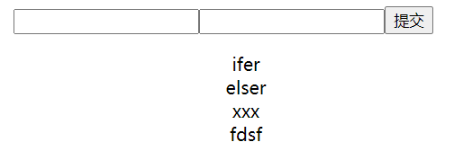
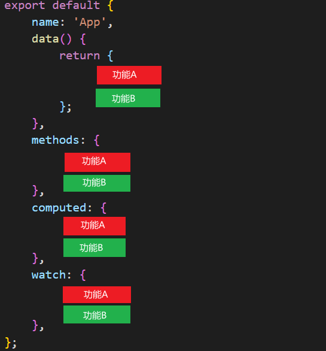
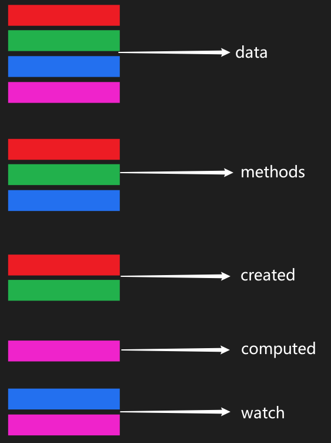
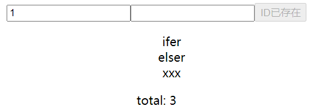

## 00. 关于 Vue3 和 Vite

**Vue3**

1、Performance

2、Tree Shaking support

3、Composition API

4、Better TS support

5、Custom Renderer API

6、Fragment、Teleport、Suspense

**Vite**

是什么：下一代前端构建工具

```bash
# 用基于 vite 的 vite-app 脚手架来初始化项目
# 使用 npm 创建
npm init vite-app studyv3
cd studyv3
npm i
npm run dev
```

```bash
# 使用全局安装的 vite 创建
npm i -g create-vite-app
create-vite-app projectName
cd projectName
npm i
npm run dev
```

## 01. Options and Compositions

### 1.1、Vue2 做个点击删除的案例

Vue3 是兼容 Vue2 的，可以使用 Vue2 的写法也可以混合使用（但不建议），下面是用 Vue2 做的点击删除的案例！



```vue
<template>
    <div>
        <form @submit.prevent="handleSubmit">
            <input type="text" v-model="user.id" />
            <input type="text" v-model="user.name" />
            <input type="submit" />
        </form>
        <ul>
            <li v-for="(item, index) in arr" :key="item.id" @click="handleClick(index)">{{ item.name }}</li>
        </ul>
    </div>
</template>

<script>
export default {
    name: 'App',
    data() {
        return {
            user: {
                id: '',
                name: '',
            },
            arr: [
                {
                    id: 0,
                    name: 'ifer',
                },
                {
                    id: 1,
                    name: 'elser',
                },
                {
                    id: 2,
                    name: 'xxx',
                },
            ],
        };
    },
    methods: {
        handleClick(index) {
            this.arr.splice(index, 1);
        },
        handleSubmit() {
            const userCopy = Object.assign({}, this.user);
            this.arr.push(userCopy);
            this.user.id = '';
            this.user.name = '';
        },
    },
};
</script>
```

### 1.2、上面写法的问题

上面代码最大的问题是：数据和业务逻辑分散在同一个文件的 N 个地方，不利于管理和维护。



随着业务复杂度的上升，可能会出现下图情况！



### 1.3、如何解决

期望数据和业务逻辑放一起（可以拆分方法和文件），怎么解决？

[why-composition-api](https://v3.vuejs.org/guide/composition-api-introduction.html#why-composition-api)

Vue3 推出的组合 API，又称注入 API，因为 composition API 的本质还是会把 数据或方法注入到 data 和 methods 中！


## 02. setup

1、实例创建前调用，执行时机早于 Vue2 中的 `beforeCreate`，它是组合 API 的入口函数

2、注意点：由于执行 `setup` 的时候实例还没有 `created`，所以在 `setup` 中是不能直接使用 `data` 和 `methods` 中的数据的，Vue 干脆把 `setup` 中的 this 绑定了 undefined，防止你乱用！

3、`setup` 返回的数据和函数可在模版中直接使用（注意 `setup` 不能为异步函数），下面是演示代码

```vue
<template>
    {{ username }}
    <button @click="handleClick">click</button>
</template>

<script>
export default {
    name: 'App',
    beforeCreate() {
        console.log(2);
    },
    setup() {
        // 先打印 1 再打印 2，证明执行时机早于 beforeCreate
        console.log(1);
        let username = 'Hello World';
        const handleClick = () => {
            console.log('Hello World');
        };
        return {
            username,
            handleClick,
        };
    },
};
</script>
```


## 03. reactive

`reactive` 是一个函数，通常用来将普通对象/数组包装成响应式式数据使用

### 3.1、包装数组

```vue
<template>
    <ul>
        <li v-for="(item, index) in arr" :key="item" @click="removeItem(index)">{{ item }}</li>
    </ul>
</template>

<script>
import { reactive } from 'vue';
export default {
    name: 'App',
    setup() {
        const arr = reactive(['a', 'b', 'c']);
        const removeItem = (index) => {
            // 点击删除当前项
            arr.splice(index, 1);
        };
        return {
            arr,
            removeItem,
        };
    },
};
</script>
```

### 3.2、包装对象

```vue
<template>
    <ul>
        <li v-for="(item, index) in state.arr" :key="item.id" @click="removeItem(index)">{{ item.name }}</li>
    </ul>
</template>

<script>
import { reactive } from 'vue';
export default {
    name: 'App',
    setup() {
        const state = reactive({
            arr: [
                {
                    id: 0,
                    name: 'ifer',
                },
                {
                    id: 1,
                    name: 'elser',
                },
                {
                    id: 2,
                    name: 'xxx',
                },
            ],
        });
        const removeItem = (index) => {
            state.arr.splice(index, 1);
        };
        return {
            state,
            removeItem,
        };
    },
};
</script>
```

### 3.3、抽离函数

优化：将同一功能的数据和业务逻辑抽离为一个函数

```vue
<template>
    <ul>
        <li v-for="(item, index) in state.arr" :key="item.id" @click="removeItem(index)">{{ item.name }}</li>
    </ul>
</template>
<script>
import { reactive } from 'vue';

function userRemoveItem() {
    const state = reactive({
        arr: [
            {
                id: 0,
                name: 'ifer',
            },
            {
                id: 1,
                name: 'elser',
            },
            {
                id: 2,
                name: 'xxx',
            },
        ],
    });
    const removeItem = (index) => {
        state.arr.splice(index, 1);
    };
    return { state, removeItem };
}

export default {
    name: 'App',
    setup() {
        const { state, removeItem } = userRemoveItem();
        return {
            state,
            removeItem,
        };
    },
};
</script>
```

### 3.4、添加功能

```vue
<template>
    <form @submit.prevent="handleSubmit">
        <input type="text" v-model="user.id" />
        <input type="text" v-model="user.name" />
        <input type="submit" />
    </form>
    <ul>
        <li v-for="(item, index) in state.arr" :key="item.id" @click="removeItem(index)">{{ item.name }}</li>
    </ul>
</template>

<script>
import { reactive } from 'vue';

function userRemoveItem() {
    const state = reactive({
        arr: [
            {
                id: 0,
                name: 'ifer',
            },
            {
                id: 1,
                name: 'elser',
            },
            {
                id: 2,
                name: 'xxx',
            },
        ],
    });
    const removeItem = (index) => {
        state.arr.splice(index, 1);
    };
    return { state, removeItem };
}
function useAddItem(state) {
    const user = reactive({
        id: '',
        name: '',
    });
    const handleSubmit = () => {
        const userCopy = Object.assign({}, user);
        state.arr.push(userCopy);
        user.id = '';
        user.name = '';
    };
    return {
        user,
        handleSubmit,
    };
}

export default {
    name: 'App',
    setup() {
        const { state, removeItem } = userRemoveItem();
        const { user, handleSubmit } = useAddItem(state);
        return {
            state,
            removeItem,
            user,
            handleSubmit,
        };
    },
};
</script>
```

### 3.5、拆分文件

`remove.js`

```js
import { reactive } from 'vue';
export default function userRemoveItem() {
    const state = reactive({
        arr: [
            {
                id: 0,
                name: 'ifer',
            },
            {
                id: 1,
                name: 'elser',
            },
            {
                id: 2,
                name: 'xxx',
            },
        ],
    });
    const removeItem = (index) => {
        state.arr.splice(index, 1);
    };
    return { state, removeItem };
}
```

`add.js`

```js
import { reactive } from 'vue';
export default function useAddItem(state) {
    const user = reactive({
        id: '',
        name: '',
    });
    const handleSubmit = () => {
        const userCopy = Object.assign({}, user);
        state.arr.push(userCopy);
        user.id = '';
        user.name = '';
    };
    return {
        user,
        handleSubmit,
    };
}
```

`App.vue`

```vue
<template>
    <form @submit.prevent="handleSubmit">
        <input type="text" v-model="user.id" />
        <input type="text" v-model="user.name" />
        <input type="submit" />
    </form>
    <ul>
        <li v-for="(item, index) in state.arr" :key="item.id" @click="removeItem(index)">{{ item.name }}</li>
    </ul>
</template>

<script>
import userRemoveItem from './remove';
import useAddItem from './add';
export default {
    name: 'App',
    setup() {
        const { state, removeItem } = userRemoveItem();
        const { user, handleSubmit } = useAddItem(state);
        return {
            state,
            removeItem,
            user,
            handleSubmit,
        };
    },
};
</script>
```

<font color="red">🤫注意</font> <font color="#ccc">当你明确知道需要的是一个响应式数据对象，那么就使用 reactive 即可，其他情况使用 ref</font>

## 04. ref

### 4.1、定义响应式数据

`ref` 函数，常用于把简单数据类型定义为响应式数据，注意 JS 中修改值需要 `.value`，模板中使用值可以省略 `.value`

```vue
<template>
    <p>{{ username }}</p>
    <button @click="handleClick">click</button>
</template>

<script>
import { ref } from 'vue';
export default {
    name: 'App',
    setup() {
        const username = ref('Hello World');
        const handleClick = () => {
            // 修改的时候需要 .value，模板中使用不需要加 .value，Vue 内部会自动添加
            username.value = 'xxx';
        };
        return {
            username,
            handleClick,
        };
    },
};
</script>
```

`ref` 的本质还是 `reactive`，当我们给 `ref` 传递一个值之后，这个值会作为 `reactive` 对象中的 value 存在

```vue
<template>
    <p>{{ username }}</p>
    <button @click="handleClick">click</button>
</template>

<script>
import { ref, reactive } from 'vue';
export default {
    name: 'App',
    setup() {
        // 注意通过 reactive 定义数据时，并不会在模板中自动添加 .value，需要手动的 username.value
        /* const username = reactive({
            value: 'Hello World',
        }); */
        const username = ref('Hello World');
        const handleClick = () => {
            username.value = 'xxx';
        };
        return {
            username,
            handleClick,
        };
    },
};
</script>
```

🎈Vue 内部会使用 `isRef` 和 `isReactive` 方法来判断是 `ref` 还是 `reactive` 数据，以此来决定添不添加 `.value`

### 4.2、计数器

```vue
<template>
    <p>{{ num }}</p>
    <button @click="add()">add</button>
    <button @click="sub()">sub</button>
</template>

<script>
import { ref } from 'vue';
function useCalc() {
    // 初始值
    const num = ref(0);
    // add
    const add = () => {
        num.value++;
    };
    // sub
    const sub = () => {
        num.value--;
    };
    return { num, add, sub };
}
export default {
    name: 'App',
    setup() {
        const { num, add, sub } = useCalc();
        return { num, add, sub };
    },
};
</script>
```

### 4.3、获取元素或组件实例

获取单个 DOM 或组件

```vue
<template>
    <!-- #3 -->
    <div ref="oDiv">Hello World</div>
</template>

<script>
import { onMounted, ref } from 'vue';
export default {
    name: 'App',
    setup() {
        // #1
        const oDiv = ref(null);
        onMounted(() => {
            console.log(oDiv.value);
        });
        // #2
        return {
            oDiv,
        };
    },
};
</script>
```

获取 v-for 遍历的 DOM 或组件

```vue
<template>
    <ul>
        <!-- #4 -->
        <li :ref="setDom" v-for="item in 'ifer'" :key="item">{{ item }}</li>
    </ul>
</template>

<script>
import { onMounted, ref } from 'vue';
export default {
    name: 'App',
    setup() {
        // #1
        const domList = [];
        // #2
        const setDom = (el) => {
            domList.push(el);
        };
        onMounted(() => {
            console.log(domList);
        });
        // #3
        return {
            setDom,
        };
    },
};
</script>
```

### 4.4、转换原始对象中的某个属性

ref，“拷贝，不会影响原，响应式”

```vue
<template>
    <p>{{ state }}</p>
    <button @click="handleClick">click</button>
</template>

<script>
import { ref } from 'vue';
export default {
    name: 'App',
    setup() {
        let obj = {
            name: 'ifer',
            age: 18,
        };
        // 这样写本质是把 obj.name 取出来了复制了一份
        const state = ref(obj.name);

        const handleClick = () => {
            state.value = 'xxx';
            console.log(obj); // 注意点：原对象 obj 中的数据并没有变化，即对 state 的操作并不会影响原数据
        };
        return {
            state,
            handleClick,
        };
    },
};
</script>
```

### 4.5、转换响应式对象中的某个属性

ref，写法上比较特殊，要小心😏

```vue
<template>
    <p>{{ state }}</p>
    <button @click="handleClick">click</button>
</template>

<script>
import { reactive, ref } from 'vue';
export default {
    name: 'App',
    setup() {
        let obj = reactive({
            name: 'ifer',
            age: 18,
        });
        // !注意 ref 得到的 reactive 数据的 .value 是一个对象，要继续通过 .name 去修改
        // ref 转换的数据 value 在前
        const state = ref(obj, 'name');

        const handleClick = () => {
            state.value.name = 'xxx';

            // 会影响原数据也会触发视图更新
            console.log(obj);
        };
        return {
            state,
            handleClick,
        };
    },
};
</script>
```


## 05. toRef

### 5.1、转换原始对象中的属性

toRef，“引用，影响原，非响应”

```vue
<template>
    <p>{{ state }}</p>
    <button @click="handleClick">click</button>
</template>

<script>
import { toRef } from 'vue';
export default {
    name: 'App',
    setup() {
        let obj = {
            name: 'ifer',
            age: 18,
        };
        // 通过 toRef 将一个对象中的属性变成 ref 数据
        const state = toRef(obj, 'name');

        const handleClick = () => {
            state.value = 'xxx';

            // 修改转换后的 ref 数据会影响到原数据，//!但不会触发视图更新！
            console.log(obj);
        };
        return {
            state,
            handleClick,
        };
    },
};
</script>
```

### 5.2、转换响应式对象中的某个属性

```vue
<template>
    <p>{{ state }}</p>
    <button @click="handleClick">click</button>
</template>

<script>
import { reactive, toRef } from 'vue';
export default {
    name: 'App',
    setup() {
        let obj = reactive({
            name: 'ifer',
            age: 18,
        });
        const state = toRef(obj, 'name');

        const handleClick = () => {
            // !注意这里的修改方式和之前不一样了
            state.value = 'xxx';
            // 会影响原数据也会触发视图更新
            console.log(obj);
        };
        return {
            state,
            handleClick,
        };
    },
};
</script>
```

## 07. 易错点

### 7.1、需求

需求：只想把用到的 username 掏出去，问题：数据不是响应式的了

```vue
<template>
    <p>{{ name }}</p>
    <button @click="updateName">update</button>
</template>

<script>
import { reactive } from 'vue';
export default {
    name: 'App',
    setup() {
        const userInfo = reactive({
            name: 'ifer',
            age: 18,
        });
        const updateName = () => {
            userInfo.name = 'xxx';
        };
        return {
            // 相当于把 userInfo.name 复制了一份给了一个新的变量 name，那么对原 userInfo 中 name 的修改
            // 根本不会影响视图中的 name，因为不是一个东西
            name: userInfo.name,
            updateName,
        };
    },
};
</script>
```

### 7.2、ref 解决

```vue
<template>
    <p>{{ state }}</p>
    <button @click="updateUserInfo">update</button>
</template>

<script>
import { reactive, ref } from 'vue';
export default {
    name: 'App',
    setup() {
        const userInfo = reactive({
            username: 'ifer',
            age: 18,
        });

        // !注意 ref 得到的 reactive 数据的 .value 是一个对象，要继续通过 .username 去修改
        // ref 转换的数据 value 在前
        const state = ref(userInfo, 'username');

        const updateUserInfo = () => {
            // 会影响原 reactive 数据 userInfo，并且是关联的
            state.value.username = 'xxx';

            // userInfo.username = 'xxx';
        };

        return {
            state,
            updateUserInfo,
        };
    },
};
</script>
```

### 7.3 toRef 解决

解决：toRef 是函数，可以转换**响应式对象**中某个属性为单独响应式数据，并且转换后的值和原对象是是关联的

```vue
<template>
    <p>{{ username }}</p>
    <button @click="updateUserInfo">update</button>
</template>

<script>
import { reactive, toRef } from 'vue';
export default {
    name: 'App',
    setup() {
        const userInfo = reactive({
            username: 'ifer',
            age: 18,
        });

        const username = toRef(userInfo, 'username');

        const updateUserInfo = () => {
            // 转换后的 username 和原对象 userInfo 中的 username 是关联的
            // userInfo.username = 'xxx';
            username.value = 'xxx';
        };

        return {
            username,
            updateUserInfo,
        };
    },
};
</script>
```

## 08. toRefs

`toRefs` 是函数，转换响应式对象中所有属性为单独响应式数据，并且转换后的值和原对象是关联的

```vue
<template>
    <p>{{ username }}</p>
    <button @click="updateUserInfo">update</button>
</template>

<script>
import { reactive, toRefs } from 'vue';
export default {
    name: 'App',
    setup() {
        const userInfo = reactive({
            username: 'ifer',
            age: 18,
        });

        const obj = toRefs(userInfo);

        const updateUserInfo = () => {
            // toRefs 转换的数据最后要加 .value，reactive 类型的数据则不用
            // obj.username.value = 'xxx';
            userInfo.username = 'xxx';
        };

        return {
            ...obj,
            updateUserInfo,
        };
    },
};
</script>
```

## 09. customRef

### 9.1 基本语法

```vue
<template>
    <p>{{ age }}</p>
    <button @click="handleClick">click</button>
</template>

<script>
import { customRef } from 'vue';

function myRef(value) {
    return customRef((track, trigger) => {
        return {
            get() {
                // !#1 追踪变化这个数据的变化
                track();
                console.log('get', value);
                return value;
            },
            set(newValue) {
                console.log('set', newValue);
                value = newValue;
                // !#2 触发界面更新
                trigger();
            },
        };
    });
}

export default {
    name: 'App',
    setup() {
        // let age = ref(18); // reactive({value: 18})
        let age = myRef(18);
        const handleClick = () => {
            // age.value => get
            // age.value = age.value + 1 => set
            // 视图中使用 {{ age }} => get
            age.value += 1;
        };
        return { age, handleClick };
    },
};
</script>
```

### 9.2 请求数据

```vue
<template>
    <ul>
        <li v-for="item in arr" :key="item.id">{{ item.name }}</li>
    </ul>
</template>

<script>
import { ref } from 'vue';
export default {
    name: 'App',
    setup() {
        const arr = ref([]);
        fetch('/data.json')
            .then((r) => r.json())
            .then((data) => {
                arr.value = data;
            })
            .catch((err) => {
                console.log(err);
            });
        return {
            arr,
        };
    },
};
</script>
```

### 9.3 封装接口

```vue
<template>
    <ul>
        <li v-for="item in list" :key="item.id">{{ item.name }}</li>
    </ul>
    <button @click="getList">getList</button>
</template>

<script>
import { customRef } from 'vue';

const fetchRef = (value) =>
    customRef((track, trigger) => {
        let result;
        const getList = () => {
            fetch(value)
                .then((r) => r.json())
                .then((data) => {
                    result = data;
                    // !#2 更新视图
                    trigger();
                })
                .catch((err) => console.log(err));
        };
        // !#0 先调用一次
        getList();

        return {
            get() {
                // 模板中使用了 list，第 1 次触发这儿
                // #2 中进行了 trigger 触发视图更新，第 2 次触发这儿
                console.log(result);
                // !#1 追踪数据变化
                track();
                return result;
            },
            set(newValue) {
                value = newValue;
                getList();
            },
        };
    });

export default {
    name: 'App',
    setup() {
        const list = fetchRef('/data.json');

        function getList() {
            list.value = '/data2.json';
        }

        return {
            list,
            getList,
        };
    },
};
</script>
```


## 10. 递归和非递归监听

### 10.1、递归监听

通过 `reactive` 和 `ref` 创建出来的数据都是递归监听的，下面是 `reactive` 数据演示

```js
<template>
    {{ state.a.b.c.d }}
    <button @click="state.a.b.c.d = 'xxx'">change</button>
</template>

<script>
import { ref, reactive, isRef, isReactive } from 'vue';
export default {
    name: 'App',
    setup() {
        const state = reactive({
            a: {
                b: {
                    c: {
                        d: 'Hello World',
                    },
                },
            },
        });
        return { state };
    },
};
</script>
```

`ref` 数据演示

```vue
<template>
    <p>{{ state.a.b.c.d }}</p>
    <button @click="handleChange">change</button>
</template>

<script>
import { ref } from 'vue';
export default {
    name: 'App',
    setup() {
        const state = ref({
            a: {
                b: {
                    c: {
                        d: 'Hello World',
                    },
                },
            },
        });
        const handleChange = () => {
            state.value.a.b.c.d = 'xxx';
        };
        return { state, handleChange };
    },
};
</script>
```

### 10.2、非递归监听

`shallowReactive`

```vue
<template>
    <p>{{ state.age }}</p>
    <p>{{ state.a.b.c.d }}</p>
    <button @click="handleChange">change</button>
</template>

<script>
import { shallowReactive } from 'vue';
export default {
    name: 'App',
    setup() {
        const state = shallowReactive({
            age: 18,
            a: {
                b: {
                    c: {
                        d: 'Hello World',
                    },
                },
            },
        });
        const handleChange = () => {
            // 只有第一层是响应式的，可以通过打印观察到
            // console.log(state);
            // 第一层的更新会影响到后面（注意 state.age 也必须写到模板上面）
            state.age = 19;
            // 如果没有上面的代码直接下面这样写界面是不会更新的
            state.a.b.c.d = 'xxx';
        };
        return { state, handleChange };
    },
};
</script>
```

`shallowRef` 的本质是 `shallowReactive`

```vue
<template>
    <p>{{ state.a.b.c.d }}</p>
    <button @click="handleChange">change</button>
</template>

<script>
import { shallowRef } from 'vue';
export default {
    name: 'App',
    setup() {
        const state = shallowRef({
            a: {
                b: {
                    c: {
                        d: 'Hello World',
                    },
                },
            },
        });
        const handleChange = () => {
            // 监听的是 state.value 的变化，因为本质上 shalloReactive 中的 value 才是第一层
            state.value = {
                a: {
                    b: {
                        c: {
                            d: 'xxx',
                        },
                    },
                },
            };
            // state.value.a.b.c.d = 'xxx'; // 不会更新视图
        };
        return { state, handleChange };
    },
};
</script>
```

`triggerRef`

```vue
<template>
    {{ state.a.b.c.d }}
    <button @click="handleChange">change</button>
</template>

<script>
import { triggerRef, shallowRef } from 'vue';
export default {
    name: 'App',
    setup() {
        const state = shallowRef({
            a: {
                b: {
                    c: {
                        d: 'Hello World',
                    },
                },
            },
        });
        const handleChange = () => {
            state.value.a.b.c.d = 'xxx';
            // 根据传入的数据主动更新界面
            // Vue3 只提供了 triggerRef 方法，没有提供 triggerReactive 方法，如果是 reactive 类型的数据是无法主动触发界面更新的
            triggerRef(state);
        };
        return { state, handleChange };
    },
};
</script>
```

## 11. toRaw

### 11.1、`原数据` 和 `reactive(原数据)`  之间的关系

原 obj 和 state 的关系：state 是根据原 obj 生成的，两者的修改会相互影响，但对 obj 的修改不是响应式的

```vue
<template>
    <p>{{ state }}</p>
    <button @click="handleClick">click</button>
</template>

<script>
import { reactive } from 'vue';
export default {
    name: 'App',
    setup() {
        const obj = {
            name: 'ifer',
            age: 18,
        };
        // state 是一个新的 Proxy 对象，这个对象是根据 obj 生成的
        const state = reactive(obj);
        // console.log(obj === state); // false
        const handleClick = () => {
            obj.name = 'xxx';
            // 因为 state 是根据 obj 生成的，所以修改 obj 会影响 state，但不是响应式的
            console.log(state.name);
        };
        return { state, handleClick };
    },
};
</script>
```

### 11.2、获取 reactive 原数据

`toRaw`：获取 `reactive` 原数据

```vue
<template>
    <p>{{ state }}</p>
    <button @click="handleClick">click</button>
</template>

<script>
import { reactive, toRaw } from 'vue';
export default {
    name: 'App',
    setup() {
        const obj1 = {
            name: 'ifer',
            age: 18,
        };
        const state = reactive(obj1);
        // toRaw 可以获取 ref 或 reactive 类型的原始数据
        // 应用场景：当有一些操作不需要更新 UI 界面的化，可以用此方法提升性能
        const obj2 = toRaw(state);
        console.log(obj1 === obj2); // true
        const handleClick = () => {
            // 无论对原 obj1 和还是对通过 toRaw 取出来的对象的修改都不是响应式的
            obj1.name = 'xxx';
            // obj2.name = 'xxx';
        };
        return { state, handleClick };
    },
};
</script>
```

### 11.3、获取 ref 原数据

toRaw：获取 ref 的原数据

```vue
<template>
    <p>{{ state }}</p>
    <button @click="handleClick">click</button>
</template>

<script>
import { toRaw, ref } from 'vue';
export default {
    name: 'App',
    setup() {
        const obj1 = {
            name: 'ifer',
            age: 18,
        };
        const state = ref(obj1);

        console.log(state === toRaw(state)); // true

        // 必须通过 toRaw(state.value) 才能得到原始数据
        console.log(obj1 === toRaw(state.value)); // true

        const handleClick = () => {
            obj1.name = 'xxx';
        };
        return { state, handleClick };
    },
};
</script>
```

## 12. markRaw

`markRaw` 包装后的数据将不被追踪变化，即便通过 `reactive` 也不能变成响应式数据

```vue
<template>
    <p>{{ state }}</p>
    <button @click="handleClick">click</button>
</template>

<script>
import { reactive, markRaw } from 'vue';
export default {
    name: 'App',
    setup() {
        let obj = {
            name: 'ifer',
            age: 18,
        };
        // obj 将不被追踪，无法成为响应式数据
        obj = markRaw(obj);
        const state = reactive(obj);
        const handleClick = () => {
            state.name = 'xxx';
        };
        return {
            state,
            handleClick,
        };
    },
};
</script>
```

## 13. readonly

```vue
<template>
    <p>{{ state.name }}</p>
    <button @click="handleClick">click</button>
</template>

<script>
import { readonly } from 'vue';

export default {
    name: 'App',
    setup() {
        const state = readonly({
            name: 'ifer',
        });
        const handleClick = () => {
            state.name = 'xxx';
            // const 内容可以改，readonly 内容都不可以改
            console.log(state.name); // 'ifer'
        };
        return { state, handleClick };
    },
};
</script>
```

shallowReadonly

```vue
<template>
    <p>{{ state.name }}</p>
    <p>{{ state.info.sex }}</p>
    <button @click="handleClick">click</button>
</template>

<script>
import { shallowReadonly } from 'vue';

export default {
    name: 'App',
    setup() {
        // shallowReadonly 创建的数据只是第一层只读
        const state = shallowReadonly({
            name: 'ifer',
            info: {
                sex: 'man',
            },
        });
        const handleClick = () => {
            state.name = 'xxx';
            state.info.sex = '男';
            console.log(state.name); // 'ifer'，第一层的修改没有变化
            console.log(state.info.sex); // '男'，第二层的修改变化了
        };
        return { state, handleClick };
    },
};
</script>
```

## 14. 📌 记录鼠标坐标案例

<font size=3 color="#ccc">1、定义一个响应式数据对象，包含 x 和 y 属性</font>

<font size=3 color="#ccc">2、在组件渲染完毕后，监听 document 的鼠标移动事件</font>

<font size=3 color="#ccc">3、指定 move 函数为事件对应回调，在函数中修改坐标</font>

<font size=3 color="#ccc">4、组件销毁时，解绑事件</font>

<font size=3 color="#ccc">5、setup 中返回数据，并在模版中使用</font>

```vue
<template>
    <div>x: {{ x }} y: {{ y }}</div>
</template>

<script>
import { onMounted, onUnmounted, reactive, toRefs } from 'vue';
const useMouse = () => {
    const mouse = reactive({
        x: 0,
        y: 0,
    });
    const move = (e) => {
        mouse.x = e.pageX;
        mouse.y = e.pageY;
    };
    onMounted(() => {
        document.addEventListener('mousemove', move);
    });
    onUnmounted(() => {
        document.removeEventListener('mousemove', move);
    });
    return mouse;
};
export default {
    name: 'App',
    setup() {
        const mouse = useMouse();
        return {
            ...toRefs(mouse),
        };
    },
};
</script>
```

## 15. computed

```vue
<template>
    <p>今年：{{ age }}</p>
    <p>{{ str }}</p>
</template>

<script>
import { computed, ref } from 'vue';
export default {
    name: 'App',
    setup() {
        const age = ref(18);
        const str = computed(() => {
            return `xxx 明年 ${age.value + 1} 岁了`;
        });
        return { age, str };
    },
};
</script>
```

高级用法

```vue
<template>
    <p>今年 {{ age }}</p>
    <p>{{ str }}</p>
    <button @click="str = 17">click</button>
</template>

<script>
import { computed, ref } from 'vue';
export default {
    name: 'App',
    setup() {
        const age = ref(18);
        // 指定一个函数
        /* const str = computed(() => {
            return `xxx 今年 ${age.value} 岁了`;
        }); */

        // 指定一个对象
        const str = computed({
            get() {
                return `xxx 明年 ${age.value + 1} 岁了`;
            },
            // 当给计算属性赋值的时候会触发这儿
            set(value) {
                age.value = value;
                console.log(`给 str 设置值的时候会触发这里`);
            },
        });
        return { age, str };
    },
};
</script>
```

## 16. watch

### 16.1、监听 ref 数据

```vue
<template>
    <p>{{ age }}</p>
    <button @click="age++">click</button>
</template>

<script>
import { watch, ref } from 'vue';
export default {
    name: 'App',
    setup() {
        const age = ref(18);

        // 监听 ref 数据 age，会触发后面的回调
        watch(age, (newValue, oldValue) => {
            console.log(newValue, oldValue);
        });

        return { age };
    },
};
</script>
```

### 16.2、监听 reactive 数据

```vue
<template>
    <p>{{ obj.hobby.eat }}</p>
    <button @click="obj.hobby.eat = '面条'">click</button>
</template>

<script>
import { watch, reactive } from 'vue';
export default {
    name: 'App',
    setup() {
        const obj = reactive({
            name: 'ifer',
            hobby: {
                eat: '西瓜',
            },
        });

        watch(obj, (newValue, oldValue) => {
            // !注意：监听对象的时候 newValue 和 oldValue 是全等的
            console.log(newValue === oldValue); // true
        });

        return { obj };
    },
};
</script>
```

### 16.3、监听对象中某一个属性的变化

复杂数据类型需要进行深度监听

```vue
<template>
    <p>{{ obj.hobby.eat }}</p>
    <button @click="obj.hobby.eat = '面条'">click</button>
</template>

<script>
import { watch, reactive } from 'vue';
export default {
    name: 'App',
    setup() {
        const obj = reactive({
            name: 'ifer',
            hobby: {
                eat: '西瓜',
            },
        });

        // 问题：不会触发后面的回调
        /* watch(
            () => obj.hobby,
            (newValue, oldValue) => {
                console.log(newValue === oldValue);
            }
        ); */

        // 通过配置项 deep 解决
        watch(
            () => obj.hobby,
            (newValue, oldValue) => {
                console.log(newValue === oldValue);
            },
            {
                deep: true,
            }
        );

        return { obj };
    },
};
</script>
```

简单数据类型

```vue
<template>
    <p>{{ obj.name }}</p>
    <button @click="obj.name = 'xxx'">click</button>
</template>

<script>
import { watch, reactive } from 'vue';
export default {
    name: 'App',
    setup() {
        const obj = reactive({
            name: 'ifer',
            hobby: {
                eat: '西瓜',
            },
        });

        watch(
            () => obj.name,
            (newValue, oldValue) => {
                console.log(newValue, oldValue);
            }
        );

        return { obj };
    },
};
</script>
```

### 16.4、监听多个数据

```vue
<template>
    <p>{{ count }}</p>
    <p>{{ obj.hobby.eat }}</p>
    <button @click="obj.hobby.eat = '面条'">click</button>
</template>

<script>
import { watch, reactive, ref } from 'vue';
export default {
    name: 'App',
    setup() {
        const count = ref(1);

        const obj = reactive({
            name: 'ifer',
            hobby: {
                eat: '西瓜',
            },
        });

        watch([count, obj], (newValue, oldValue) => {
            // newValue => [newCount, newObj]Array
            // oldValue => [oldCount, oldObj]Array
            console.log(newValue, oldValue);
        });

        return { count, obj };
    },
};
</script>
```

## 17. watchEffect

1、`watchEffect `不需要手动传入依赖

2、`watchEffect` 会先执行一次用来自动收集依赖

3、`watchEffect` 无法获取到变化前的值， 只能获取变化后的值

```vue
<template>
    <p>{{ age }}</p>
    <button @click="age++">click</button>
</template>

<script>
import { ref, watchEffect } from 'vue';
export default {
    name: 'App',
    setup() {
        const age = ref(18);

        watchEffect(() => {
            console.log(age.value);
        });

        return { age };
    },
};
</script>
```
## 18. 组件通讯

### 18.1、父传子

`App.vue`

```vue
<template>
    <p>{{ count }}</p>
    <button @click="count++">add</button>
    <hr />
    <hello-world :count="count" />
</template>

<script>
import { ref } from 'vue';
import HelloWorld from './components/HelloWorld.vue';
export default {
    name: 'App',
    components: {
        HelloWorld,
    },
    setup() {
        const count = ref(1);
        return {
            count,
        };
    },
};
</script>
```

`HelloWorld.vue`

```vue
<template>{{ count }}</template>

<script>
export default {
    name: 'HelloWorld',
    // 还是使用 props 进行接收
    props: {
        count: {
            type: Number,
            default: 0,
        },
    },
    setup(props) {
        // !可以通过 props 拿到传递过来的数据
        console.log(props.count);
    },
};
</script>
```

### 18.2、子传父

`App.vue`

```vue
<template>
    <p>{{ count }}</p>
    <hr />
    <hello-world :count="count" @change="count = $event" />
</template>

<script>
import { ref } from 'vue';
import HelloWorld from './components/HelloWorld.vue';
export default {
    name: 'App',
    components: {
        HelloWorld,
    },
    setup() {
        const count = ref(1);
        return {
            count,
        };
    },
};
</script>
```

`HelloWorld.vue`

```vue
<template>
    <button @click="handleClick">子传父</button>
</template>

<script>
export default {
    name: 'HelloWorld',
    props: ['count'],
    // !可以省略
    // emits: ['change'],
    // !意义在于可以指定一个对象
    emits: {
        change: (count) => {
            // 不符合条件时控制台会出现警告
            if (count >= 10) return false;
            return true;
        },
    },
    setup(props, ctx) {
        const handleClick = () => {
            ctx.emit('change', props.count + 2);
        };
        return {
            handleClick,
        };
    },
};
</script>
```

### 18.3、跨层级传递

这种传值方式又称`依赖注入`

`App.vue`

```vue
<template>
    App {{ num }}
    <hr />
    <father />
</template>

<script>
import { provide, ref } from 'vue';
import Father from './Father.vue';
export default {
    name: 'App',
    components: {
        Father,
    },
    setup() {
        const num = ref(10);
        const changeNum = () => {
            num.value = 100;
        };
        provide('num', num);
        provide('changeNum', changeNum);
        return {
            num,
        };
    },
};
</script>
```

`Father.vue`

```vue
<template>
    Father {{ num }}
    <hr />
    <child />
</template>

<script>
import { inject } from 'vue';
import Child from './Child.vue';
export default {
    name: 'Father',
    components: {
        Child,
    },
    setup() {
        const num = inject('num');
        return {
            num,
        };
    },
};
</script>
```

`Child.vue`

```vue
<template>
    <p>Child {{ num }}</p>
    <button @click="changeNum">change</button>
</template>

<script>
import { inject } from 'vue';
export default {
    name: 'Children',
    setup() {
        const num = inject('num');
        const changeNum = inject('changeNum');
        return {
            num,
            changeNum,
        };
    },
};
</script>
```

## 19. v-model

### 19.1、基本使用

`App.vue`

```vue
<template>
    {{ pageTitle }}
    <hr />
    <!-- <hello-world :modelValue="pageTitle" @update:modelValue="pageTitle = $event" /> -->
    <!-- 和上面等价 -->
    <hello-world v-model="pageTitle" />
</template>

<script>
import { ref } from 'vue';
import HelloWorld from './components/HelloWorld.vue';
export default {
    name: 'App',
    components: {
        HelloWorld,
    },
    setup() {
        const pageTitle = ref('Hello World');
        return { pageTitle };
    },
};
</script>
```

`HelloWorld.vue`

```vue
<template>
    <button @click="handleClick">修改</button>
</template>

<script>
export default {
    name: 'HelloWorld',
    setup(props, ctx) {
        const handleClick = () => {
            ctx.emit('update:modelValue', '哈哈');
        };
        return {
            handleClick,
        };
    },
};
</script>
```

### 19.2、修改默认的 modelValue

`App.vue`

```vue
<template>
    {{ pageTitle }}
    <hr />
    <!-- <hello-world :title="pageTitle" @update:title="pageTitle = $event" /> -->
    <!-- 和上面等价 -->
    <hello-world v-model:title="pageTitle" />
</template>

<script>
import { ref } from 'vue';
import HelloWorld from './components/HelloWorld.vue';
export default {
    name: 'App',
    components: {
        HelloWorld,
    },
    setup() {
        const pageTitle = ref('Hello World');
        return { pageTitle };
    },
};
</script>
```

`HelloWorld.vue`

```vue
<template>
    <button @click="handleClick">修改</button>
</template>

<script>
export default {
    name: 'HelloWorld',
    setup(props, ctx) {
        const handleClick = () => {
            ctx.emit('update:title', '哈哈');
        };
        return {
            handleClick,
        };
    },
};
</script>

```

## 21. Teleport

希望在组件内部使用 `Dialog`, 又希望渲染的 DOM 结构不嵌套在组件的 DOM 中

App.vue

```vue
<template>
    <div>
        <Dialog v-model:show="show">
            <template v-slot:header>
                <div>标题</div>
            </template>
            <div>内容</div>
            <template v-slot:footer>
                <div>页脚</div>
            </template>
        </Dialog>
        <button @click="handleClick">显示/隐藏</button>
    </div>
</template>

<script>
import { ref } from 'vue';
import Dialog from './components/Dialog.vue';
export default {
    name: 'App',
    components: {
        Dialog,
    },
    setup() {
        const show = ref(false);
        const handleClick = () => {
            show.value = !show.value;
        };
        return { show, handleClick };
    },
};
</script>
```

Dialog.vue

```vue
<template>
    <teleport to="#dialog">
        <div class="wrapper" v-show="show" @click="$emit('update:show', !show)">
            <div class="el-message-box" @click.stop>
                <span @click.stop="$emit('update:show', !show)">x</span>
                <div class="header">
                    <slot name="header"></slot>
                </div>
                <div class="content">
                    <slot></slot>
                </div>
                <div class="footer">
                    <slot name="footer"></slot>
                </div>
            </div>
        </div>
    </teleport>
</template>

<script>
export default {
    name: 'Dialog',
    props: ['show'],
};
</script>

<style>
.wrapper {
    position: fixed;
    top: 0;
    right: 0;
    bottom: 0;
    left: 0;
    background-color: rgba(0, 0, 0, 0.23);
}
.el-message-box {
    position: absolute;
    top: 50%;
    left: 50%;
    transform: translate(-50%, -50%);
    width: 420px;
    padding-bottom: 10px;
    vertical-align: middle;
    background-color: #fff;
    border-radius: 4px;
    border: 1px solid #ebeef5;
    font-size: 18px;
    box-shadow: 0 2px 12px 0 rgb(0 0 0 / 10%);
    text-align: left;
    overflow: hidden;
    backface-visibility: hidden;
}
</style>
```

## 22. Suspense

App.vue

```vue
<template>
    <div>
        <suspense>
            <template #default>
                <async-home />
            </template>
            <template #fallback>
                <loading />
            </template>
        </suspense>
    </div>
</template>

<script>
// Suspense 是一个内置的全局组件，有两个插槽
// 如果 default 插槽中的内容可以显示，那就展示 default 中的内容
// 否则展示 fallback 插槽中的内容
import { defineAsyncComponent } from 'vue';
import Loading from './components/Loading.vue';
const AsyncHome = defineAsyncComponent(() => import('./components/Home.vue'));

export default {
    name: 'App',
    components: {
        AsyncHome,
        Loading,
    },
};
</script>
```

Loading.vue

```vue
<template>
    <div>loading...</div>
</template>

<script>
export default {
    name: 'Loading',
};
</script>
```

Home.vue

```vue
<template>
    <div>xxx</div>
</template>

<script>
export default {
    name: 'Home',
};
</script>
```

## 23. Fragment

不必有一个根节点

```vue
<template>
    <h1>Hello World</h1>
    <p>xxx</p>
</template>

<script>
export default {
    name: 'App',
};
</script>
```

## 24. Vue3 响应式的原理

**`Object.defineProperty`**

```js
const obj = {
    name: 'ifer',
    age: 18
};
const copyObj = { ...obj };
Object.keys(obj).forEach(item => {
    Object.defineProperty(obj, item, {
        get() {
            return copyObj[item];
        },
        set(newValue) {
            copyObj[item] = newValue;
        }
    });
});
```

1、只能对已存在的属性进行劫持，后续添加的属性没有感知（不具有响应式），删除属性没有感知

2、在 get 和 set 里面不能直接对原对象进行操作，否则会栈溢出；需要深拷贝一份原对象（可能会有性能问题）

3、对象里面还有复杂数据类型的话，需要递归劫持里面的**每一个属性**（性能问题）

4、Vue 没有提供对数组的监听（并不是 Object.defineProperty 不支持对数组的劫持），性能问题！

[#8562](https://hub.fastgit.org/vuejs/vue/issues/8562)

**`Proxy`**

```js
const obj = {
    name: 'ifer',
    age: 18
};
const proxyObj = new Proxy(obj, {
    deleteProperty(target, key) {
        console.log('delete', key)
        delete target[key];
    },
    get(target, key) {
        console.log('get', key)
        return target[key];
    },
    set(target, key, newValue) {
        console.log(newValue);
        target[key] = newValue;
    },
});
```

Proxy 可以解决以上所有问题，注意 Proxy 监听的是整个对象，但是不能深度监听（对象里面还有复杂数据类型的话还是需要递归，但操作的是整个对象，而不需递归对象里面的每一个属性，性能也得到了大大的提升）

==核心一句话，换成 Proxy 主要是出于性能考虑！==

## 25. 用 Vue3 做个案例



```vue
<template>
    <div>
        <form @submit.prevent="handleSubmit">
            <input type="text" v-model="user.id" />
            <input type="text" v-model="user.name" />
            <input type="submit" :disabled="disabled" :value="disabled ? 'ID已存在' : '提交'" />
        </form>
        <ul>
            <li v-for="(item, index) in arr" :key="item.id" @click="handleClick(index)">{{ item.name }}</li>
        </ul>
        <div>total: {{ total }}</div>
    </div>
</template>

<script>
export default {
    name: 'App',
    data() {
        return {
            // !#1
            user: {
                id: '',
                name: '',
            },
            disabled: false,
            arr: [
                {
                    id: 0,
                    name: 'ifer',
                },
                {
                    id: 1,
                    name: 'elser',
                },
                {
                    id: 2,
                    name: 'xxx',
                },
            ],
        };
    },
    methods: {
        // !#2
        handleClick(index) {
            this.arr.splice(index, 1);
        },
        handleSubmit() {
            // 第一个写空对象的目的：为了防止有多个拷贝的数据会影响到第一个，例如 Object.assign(a, b)，b 就会影响到 a
            const user = Object.assign({}, this.user);
            this.arr.push(user);
            // 当然这样操作不会影响，因为重新改变了指向
            // this.user = {};
            this.user.id = '';
            this.user.name = '';
        },
    },
    computed: {
        // !#3
        total() {
            return this.arr.length;
        },
    },
    watch: {
        // !#4
        'user.id': function (id) {
            this.disabled = !!this.arr.find((item) => item.id === +id);
        },
    },
};
</script>
```


## 26. 生命周期

### 2.1 `setup`

实例创建前

### 2.2 `onBeforeMount`

挂载 DOM 前

### 2.3 `onMounted`

 挂载 DOM 后

### 2.4 `onBeforeUpdate`

更新组件前

### 2.5 `onUpdated` 

更新组件后

### 2.6 `onBeforeUnmount` 

卸载销毁前

### 2.7 `onUnmounted` 

卸载销毁后

### 2.8 test

<font size=2>**Vue3（组合 API）的生命周期钩子有 7 个，可以多次使用同一个钩子，执行顺序和书写顺序相同**</font>

App.vue

```vue
<template>
    <hello-world v-if="bBar" />
    <button @click="bBar = !bBar">destroy cmp</button>
</template>

<script>
import HelloWorld from './components/HelloWorld.vue';
import { ref } from 'vue';
export default {
    name: 'App',
    components: {
        HelloWorld,
    },
    setup() {
        const bBar = ref(true);
        return {
            bBar,
        };
    },
};
</script>
```

HelloWorld.vue

```vue
<template>
    <p>{{ msg }}</p>
    <button @click="msg = 'xxx'">update msg</button>
</template>

<script>
import { onBeforeMount, onMounted, onBeforeUpdate, onUpdated, onBeforeUnmount, onUnmounted, ref } from 'vue';
export default {
    name: 'HelloWorld',
    setup() {
        const msg = ref('Hello World');

        onBeforeMount(() => {
            console.log('onBeforeMount');
        });
        onMounted(() => {
            console.log('onMounted');
        });
        onBeforeUpdate(() => {
            console.log('onBeforeUpdate');
        });
        onUpdated(() => {
            console.log('onUpdated');
        });
        onBeforeUnmount(() => {
            console.log('onBeforeUnmount');
        });
        onUnmounted(() => {
            console.log('onUnmounted');
        });
        return {
            msg,
        };
    },
};
</script>
```


